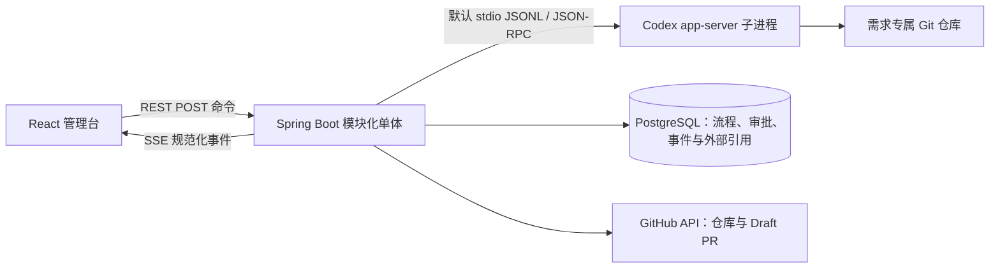

# 需求到交付流程平台与 Skill 节点：业界一手资料研究

> 研究日期：2026-08-17  
> 范围：面向软件团队的内部流程治理平台；管理员配置流程；流程节点可执行一个 Skill 或一组 Skills。  
> 资料原则：只使用标准组织、官方产品文档、官方开源项目文档和官方规范。

## 结论摘要

第一版不应试图复制 Jira、GitHub Actions、BPMN 套件和 AI Agent 平台。更稳妥的定位是“研发流程治理与证据中枢”：它编排人工任务、审批、系统集成与 AI Skill，保存每个阶段的输入、输出、责任人、质量门禁和审计证据；代码托管、CI/CD、文档库等仍由现有系统负责。

建议采用以下核心设计：

1. 主流程采用“需求进入 → 澄清与分析 → SDD 规格与评审 → 计划 → 实现与代码评审 → 验证 → 发布 → 运行反馈/归档”八阶段，但阶段名和节点由管理员通过版本化模板配置。ISO/IEC/IEEE 12207:2026 明确覆盖构想、开发、运行、支持和退役，并允许过程并发、迭代、递归和增量应用，因此平台不应把行业流程误做成只能单向推进的瀑布流。[ISO/IEC/IEEE 12207:2026](https://www.iso.org/standard/90219.html)
2. “阶段”用于面向人的治理与看板，“节点/连线”用于可执行编排，“门禁”是进入下一阶段所需满足的可验证规则；不要把三者混成一个状态字段。
3. 流程定义发布后不可原地修改。运行实例固定到流程版本；Skill 节点固定到 Skill 版本或内容摘要。新版本只影响新实例，运行中实例仅能通过显式迁移变更，并保留迁移人、原因和前后版本。Camunda 的官方版本化文档采用相同原则：旧实例默认继续运行其启动版本，新实例使用新版本。[Camunda 流程定义版本化](https://docs.camunda.io/docs/components/best-practices/operations/versioning-process-definitions/)
4. 单个 Skill 与一组 Skills 不必设计成两套执行引擎。第一版可将叶子节点统一为 `SkillTask`，将技能组实现为可复用的 `SkillGroup` 子流程。BPMN 的 Call Activity、Camunda 的可复用外部子流程、Argo 的 WorkflowTemplate/DAG 都证明“可复用子流程 + 显式输入输出”是成熟抽象。[OMG BPMN 2.0.2](https://www.omg.org/spec/BPMN/)、[Camunda Call Activity](https://docs.camunda.io/docs/components/modeler/bpmn/call-activities/)、[Argo WorkflowTemplate](https://argo-workflows.readthedocs.io/en/latest/workflow-templates/)
5. 第一版的技能组仅支持管理员预编排的“顺序执行”，失败停在当前步骤；不支持 AI 动态选路、并行、任意循环、动态生成图、嵌套技能组和复杂补偿。并行全成功可作为第二阶段能力，复杂流程则通过通用子流程演进。
6. 每个 Skill 必须拥有显式契约：用途、版本、输入 JSON Schema、输出 JSON Schema、产物类型、权限需求、超时、重试策略和副作用级别。OpenAI 官方函数调用文档使用 JSON Schema 定义工具，并建议启用严格模式保证参数遵循 Schema；OpenAI Skills 官方文档也要求聚焦单一任务并写明显式输入和输出。[OpenAI Function Calling](https://developers.openai.com/api/docs/guides/function-calling)、[OpenAI Build Skills](https://developers.openai.com/codex/skills)
7. 质量门禁不应只看“按钮已点击”，而应验证证据。例如需求门禁检查验收标准和责任人，合并门禁检查代码评审与自动化测试，发布门禁检查发布审批、制品摘要、回滚方案和部署结果。GitHub 官方分支保护把评审、状态检查、对话解决和部署成功作为可强制条件；环境保护支持必需审批人并可禁止自审。[GitHub 分支保护](https://docs.github.com/en/repositories/configuring-branches-and-merges-in-your-repository/managing-protected-branches/about-protected-branches)、[GitHub 部署与环境](https://docs.github.com/en/actions/reference/workflows-and-actions/deployments-and-environments)
8. AI 只负责建议或执行，不天然拥有通过门禁的权力。外部写入、破坏性操作、生产发布、采购/花费、权限扩大和范围扩张应要求人工批准。OpenAI 官方模型指导同样建议为外部写入、破坏性、付费或扩大范围的操作设置确认边界。[OpenAI 模型指导：自主性与审批边界](https://developers.openai.com/api/docs/guides/latest-model)
9. 审计必须是一等能力：保存谁在何时基于哪个流程版本、Skill 版本、模型/执行器版本和输入摘要做了什么，产生了哪些输出与证据，谁批准或驳回，以及调用了哪些外部系统。OpenTelemetry 将一次端到端操作建模为 Trace、将子操作建模为 Span，可作为跨服务关联方式；业务审计事件仍应在业务库中独立、长期保存。[OpenTelemetry Tracing](https://opentelemetry.io/docs/specs/otel/overview/)
10. OpenSpec、Matt Pocock Skills 和 Superpowers 都值得复用，但分别偏向“规格工件协议”和“Agent 执行方法”，不是企业级持久流程运行时。第一版应明确分离工件协议、Skill/Playbook、外部工具和 Workflow Runtime，不能用文件是否存在、聊天上下文或 Skill 自然语言调用代替节点状态、审批、权限和审计。[OpenSpec 官方仓库](https://github.com/Fission-AI/OpenSpec)、[Matt Pocock Skills](https://github.com/mattpocock/skills)、[Superpowers](https://github.com/obra/superpowers)
11. 在已明确的 Windows 内网单机约束下，首版技术组合建议直接收敛为：**Java 21 + Spring Boot 4.1.x 模块化单体 + PostgreSQL 中的受限状态机 + React 19.2/TypeScript + React Flow 12 + REST 命令接口/SSE 事件流 + Java 通过默认 stdio JSONL 管理 Codex app-server**。浏览器不直接连接 app-server；Flowable 8 是流程复杂度达到可验证阈值后的第一升级路径。[Spring Boot 系统要求](https://docs.spring.io/spring-boot/system-requirements.html)、[React 版本](https://react.dev/versions)、[Codex app-server 官方 README](https://github.com/openai/codex/blob/main/codex-rs/app-server/README.md)

## 一、行业流程应如何落到产品中

### 1. 行业标准给出的边界，而不是固定瀑布阶段

ISO/IEC/IEEE 12207:2026 建立的是覆盖完整软件生命周期的共同过程框架，包括构想、开发、运行、支持与退役，同时明确不强制某一种生命周期模型或开发方法，并允许过程并发、迭代、递归和增量应用。[ISO/IEC/IEEE 12207:2026](https://www.iso.org/standard/90219.html)

ISO/IEC/IEEE 29148:2018 则要求需求工程活动贯穿生命周期，并定义需求过程及其信息项。这支持将 SDD 视为版本化、可追踪的规格，而不是只在开工前上传一次的静态 Word 文档。[ISO/IEC/IEEE 29148:2018](https://www.iso.org/standard/72089.html)

因此，“参考业界”更合适的产品表达不是写死唯一流程，而是：

- 提供一套推荐的标准模板；
- 管理员可在受限模型内修改阶段、节点、角色、门禁和交付物；
- 每个项目实例固定使用某个模板版本；
- 支持驳回、返工和迭代，但第一版限制图能力，避免直接实现完整 BPMN。

### 2. 推荐的八阶段基线

| 阶段 | 核心目的 | 最小产物/证据 | 推荐退出门禁 |
| --- | --- | --- | --- |
| 1. 需求进入与分诊 | 判断价值、归属、紧急度和是否受理 | 需求卡、提出人、业务目标、优先级、责任人 | 必填字段完整；已分配负责人；受理/拒绝决定有理由 |
| 2. 澄清与需求分析 | 消除歧义，明确范围、约束、风险和验收标准 | 用户故事/用例、范围内外、验收标准、依赖与风险 | 关键干系人确认；需求可测试；未决问题低于阈值 |
| 3. SDD 规格与评审 | 形成可追踪的规格和技术方案 | SDD 版本、接口/数据/非功能要求、需求追踪、评审意见 | 产品与技术评审通过；高风险项有处置；规格版本冻结 |
| 4. 计划与就绪 | 把规格拆成可执行工作并确定交付策略 | 任务拆分、估算、负责人、里程碑、测试与发布计划 | 依赖已处理；容量可接受；任务具备进入实现条件 |
| 5. 实现与代码评审 | 产出源代码、迁移、配置和文档 | 分支/提交/PR、代码评审记录、构建结果 | 评审通过；必需状态检查通过；讨论已解决 |
| 6. 验证与验收 | 证明需求、质量与安全要求被满足 | 测试报告、安全扫描、缺陷清单、业务验收 | 验收标准全部有证据；阻断缺陷为零；例外有审批和期限 |
| 7. 发布与交付 | 受控地生成、批准和部署可追溯制品 | 制品摘要、来源/构建证明、发布单、回滚方案、部署结果 | 生产审批通过；制品与测试对象一致；回滚可执行 |
| 8. 运行反馈与归档 | 观察实际结果、处理事件并反馈下一轮 | 运行指标、事件、用户反馈、复盘、遗留项 | 观察期结束；遗留项已归属；产物与审计记录归档 |

这套阶段是产品默认模板，不是底层引擎的硬编码。Scrum Guide 将 Definition of Done 定义为增量满足质量措施时的正式状态，并规定未满足 DoD 的工作不能发布；这支持把质量条件作为显式门禁而不是个人判断。[Scrum Guide 2020](https://scrumguides.org/docs/scrumguide/v2020/2020-Scrum-Guide-US.pdf)

### 3. 安全与供应链门禁应横切整个流程

NIST SSDF 1.1 明确表示安全实践应集成进既有 SDLC，而不是另建一条孤立的“安全阶段”，并将实践归为准备组织（PO）、保护软件（PS）、生产良好安全软件（PW）和响应漏洞（RV）。因此，权限、依赖、代码扫描、制品完整性和漏洞响应应分布在相关阶段中。[NIST SP 800-218 SSDF 1.1](https://csrc.nist.gov/pubs/sp/800/218/final)

发布证据还应把制品与其来源、构建过程和输入关联起来。SLSA 1.2 将 provenance 定义为可验证地描述软件制品在何时、何处、如何产生的信息。[SLSA 1.2 Provenance](https://slsa.dev/spec/v1.2/provenance)

第一版可只保存外部证据链接和摘要，不必自己实现扫描器或制品签名：

- `commitSha` / `pullRequestUrl`；
- `ciRunUrl` / `testReportUrl` / `securityReportUrl`；
- `artifactUri` / `artifactDigest` / `provenanceUri`；
- `deploymentId` / `environment` / `rollbackPlanUrl`。

## 二、流程、节点、子流程与版本化定义

### 1. 建议分成四层

| 层 | 含义 | 示例 |
| --- | --- | --- |
| 阶段（Stage） | 面向团队的治理分组与看板列，不直接执行 | “SDD 规格与评审” |
| 节点（Node） | 可执行或可等待的原子步骤 | 人工填写、人工审批、调用 Skill、条件判断 |
| 子流程（Subflow） | 可复用的一组节点，拥有独立输入输出 | “标准安全评审包”“发布检查包” |
| 门禁（Gate） | 决定能否进入后续阶段的规则集合 | 所需审批完成且测试报告通过 |

BPMN 2.0.2 是由 OMG 维护的业务流程标准；其中子流程与 Call Activity 是成熟的复用概念。[OMG BPMN 2.0.2](https://www.omg.org/spec/BPMN/) Camunda 的 Call Activity 会创建被调用流程实例，完成后父流程才继续，并支持显式输入/输出变量映射。[Camunda Call Activity](https://docs.camunda.io/docs/components/modeler/bpmn/call-activities/)

### 2. 第一版节点类型

建议仅实现六种节点，足以覆盖主流程：

1. `HUMAN_TASK`：填写、补充、处理；有负责人/候选角色、截止时间和表单。
2. `APPROVAL`：批准、驳回或要求修改；支持禁止申请人自批。
3. `SKILL_TASK`：调用一个固定版本 Skill。
4. `SKILL_GROUP`：调用管理员预先排序的一组固定版本 Skills；第一版只支持 `SEQUENTIAL`。
5. `DECISION`：根据结构化字段执行条件分支；表达式由平台解释，不执行任意脚本。
6. `START` / `END`：流程边界。

第一版可以把阶段门禁表达为阶段末尾的 `APPROVAL` 或自动 `DECISION`，无需再实现一种复杂节点。若门禁规则日后需要复用、组合和单独审计，再提升为独立 `GATE` 类型。

### 3. Skill 组应是受限子流程，而不是字符串数组

Argo Workflows 的官方模型支持顺序 Steps、DAG 依赖、输入输出参数和可复用 WorkflowTemplate；被 DAG 或 Steps 调用的模板还可以再次是 DAG/Steps，这说明组合能力应来自流程结构，而不是在单个任务里写一段不透明提示词。[Argo DAG](https://argo-workflows.readthedocs.io/en/latest/walk-through/dag/)、[Argo Workflow 结构](https://argo-workflows.readthedocs.io/en/latest/walk-through/the-structure-of-workflow-specs/)

不过第一版不要直接开放任意 DAG。`SKILL_GROUP` 最小语义建议为：

```yaml
mode: SEQUENTIAL
skills:
  - skillId: requirement-clarifier
    version: 1.2.0
    inputMapping: { requirement: "$.requirement" }
  - skillId: acceptance-criteria-checker
    version: 1.0.3
    inputMapping: { specification: "$.previous.output" }
successPolicy: ALL_SUCCEEDED
```

约束：

- `SEQUENTIAL`：前一步输出可映射到后一步输入；任一步失败则组失败。
- 第一版不支持并行、动态扩展、循环、嵌套 SkillGroup、失败补偿和人工步骤混入组内。
- 后续增加 `PARALLEL_ALL` 时，各 Skill 只能读取组输入，不允许相互依赖，并要求全部成功；不要一开始就支持 `PARALLEL_ANY`。
- 需要人工审批或复杂分支时，管理员应使用普通流程节点和子流程，而不是 SkillGroup。

### 4. 版本策略

流程模板生命周期建议为：

`DRAFT → PUBLISHED → RETIRED`

- `DRAFT` 可编辑、预览和校验，不能启动正式实例。
- `PUBLISHED` 内容不可变；修改必须“复制为新版本”。
- `RETIRED` 不允许新实例使用，但历史实例和审计记录仍可读取。
- 运行实例记录 `workflowDefinitionId + workflowVersion`，不保存“始终使用最新”。
- 每个 Skill 引用记录 `skillId + skillVersion + contentDigest`。
- 运行中实例默认继续原版本。迁移需要管理员显式操作，迁移前校验活动节点映射，并记录原因与审计事件。

Camunda 官方文档指出，多个流程版本并行运行会带来运维复杂度，但默认保持旧实例继续原版本可避免新部署破坏在途实例。[Camunda 流程定义版本化](https://docs.camunda.io/docs/components/best-practices/operations/versioning-process-definitions/) 对外部子流程或共享依赖，Camunda 还提供 `latest`、同批部署和 `versionTag` 三种绑定，并提示 `latest` 可能带来不可预期行为。[Camunda 资源版本绑定](https://docs.camunda.io/docs/components/best-practices/modeling/choosing-the-resource-binding-type/)

因此，本平台生产流程第一版应默认禁止 `latest` Skill 绑定，只有草稿预览可临时使用最新版本。

## 三、Skill 的复用、契约、权限和审计

### 1. Skill 与 Tool/Connector 必须区分

OpenAI 官方文档把 Skill 定义为面向特定任务的可复用工作流包，可包含说明、资源与可选脚本；官方最佳实践要求每个 Skill 聚焦一项工作，并用显式输入和输出描述命令式步骤。[OpenAI Build Skills](https://developers.openai.com/codex/skills)

开放 Agent Skills 规范只强制 `SKILL.md` 的名称、描述和指令等文件格式；`allowed-tools` 仍是实验字段，也没有强制的机器可验证输入/输出 Schema。因此，本平台如果兼容 Agent Skills，仍必须在自己的 `SkillVersion` 清单中补充执行契约、权限、版本和审计元数据，不能把 `SKILL.md` 直接当成安全执行契约。[Agent Skills 规范](https://agentskills.io/specification)

产品领域模型应区分：

- **Skill**：如何完成某项任务的可复用能力/工作流，例如“澄清需求”“生成测试方案”。
- **Tool/Connector**：访问外部数据或执行动作的技术能力，例如 GitHub、Jira、邮件、数据库。
- **Executor**：真正运行 Skill 的执行适配器，例如某个模型、Agent 服务或内部微服务。

这样同一个 Skill 可以更换执行器，但每次运行仍记录实际执行器版本；同一个外部 Tool 也能被多个 Skills 使用。

### 2. SkillVersion 最小契约

建议每个 Skill 版本至少包含：

| 字段 | 用途 |
| --- | --- |
| `skillId`, `version`, `contentDigest` | 唯一标识、版本固定和防篡改核对 |
| `name`, `description` | 管理员发现和选择 Skill |
| `inputSchema`, `outputSchema` | 结构化输入输出校验 |
| `artifactTypes` | 允许产生的文档、报告、代码或链接类型 |
| `executorType`, `executorRef` | 运行方式与固定执行器版本 |
| `requiredCapabilities` | 所需模型、工具或连接器 |
| `permissionScopes` | 最小权限集合 |
| `effectLevel` | `READ_ONLY`、`INTERNAL_WRITE`、`EXTERNAL_WRITE`、`DESTRUCTIVE` |
| `timeoutSeconds`, `retryPolicy` | 运行边界；避免无限运行 |
| `approvalPolicy` | 哪类操作必须人工批准 |
| `owner`, `status` | 维护责任与发布状态 |

OpenAI Function Calling 使用 JSON Schema 声明函数参数；严格模式会确保调用遵循 Schema，并要求对象关闭额外属性、所有属性声明为 required（可空字段用 `null` 表示）。这可直接借鉴为 Skill 输入输出校验规则。[OpenAI Function Calling 严格模式](https://developers.openai.com/api/docs/guides/function-calling#strict-mode)

MCP 工具规范也同时提供 `inputSchema` 和可选 `outputSchema`，要求服务端输出符合 Schema、客户端校验结构化结果，并建议敏感操作由用户确认、设置超时和记录工具使用。它可作为外部 Tool/Connector 适配器的直接契约参考。[MCP Tools](https://modelcontextprotocol.io/specification/2025-06-18/server/tools)

需要注意：LLM 的自然语言最终输出不应直接决定节点成功。执行器应先生成结构化结果，再由平台用输出 Schema 和门禁规则验证；最终说明文本仅作为展示附件。

### 3. 权限与人工审批

最低要求：

- 平台使用 RBAC 控制谁能创建、发布、停用流程与 Skill，谁能迁移实例，谁能审批。
- Skill 只获得声明过的连接器和权限范围；凭据保存于密钥系统，流程变量只保存凭据引用。
- 父流程不自动把全部密钥传给子流程/SkillGroup。GitHub 可复用工作流的密钥只会传给直接调用的下一层，进一步传递需再次显式声明，这是一种值得采用的最小权限模式。[GitHub 可复用工作流](https://docs.github.com/en/actions/how-tos/reuse-automations/reuse-workflows)
- MCP 官方授权规范要求基于 OAuth 的资源与授权服务发现，并强调目标资源和最小范围；可作为连接器授权边界的参考。[MCP Authorization](https://modelcontextprotocol.io/specification/2025-11-25/basic/authorization)
- `EXTERNAL_WRITE`、`DESTRUCTIVE`、生产发布、成本超阈值、权限提升和数据外发必须暂停等待人工审批。
- 审批策略支持职责分离：发起人不能审批自己的发布；GitHub 受保护环境也提供禁止自审的官方能力。[GitHub 部署与环境](https://docs.github.com/en/actions/reference/workflows-and-actions/deployments-and-environments)

### 4. 重试、幂等与失败语义

自动节点可能因网络、限流或执行器故障失败。第一版应区分：

- `SUCCEEDED`：输出契约与完成条件通过；
- `FAILED_RETRYABLE`：允许按策略重试；
- `FAILED_FINAL`：不可自动重试；
- `WAITING_APPROVAL`：等待人类授权；
- `CANCELED`：人为终止；
- `TIMED_OUT`：超过执行时限。

仅对无副作用或已声明幂等键的 Skill 自动重试。外部写入节点重试前必须使用相同 `idempotencyKey` 或重新审批，避免重复建单、重复发布或重复发消息。

### 5. 审计事件与可观测性

每个流程实例应有不可覆盖的事件序列。最小 `AuditEvent` 字段：

```text
eventId, occurredAt, tenantId, actorType, actorId,
workflowInstanceId, workflowDefinitionId, workflowVersion,
nodeRunId, nodeDefinitionId,
skillId, skillVersion, contentDigest,
executorRef, modelRef,
action, statusBefore, statusAfter,
inputDigest, outputDigest, artifactRefs,
approvalId, reason, traceId, externalRequestIds
```

敏感输入输出不直接复制进审计日志，而保存受权限控制的产物引用和哈希。审计事件与运行日志分开：审计回答“谁授权并改变了什么”，日志/Trace 回答“执行过程为何失败或变慢”。OpenTelemetry 的 Trace/Span 父子关系适合关联流程运行、节点运行和外部调用。[OpenTelemetry 概览](https://opentelemetry.io/docs/specs/otel/overview/)

产物追踪关系可借用 W3C PROV 的三个核心视角：`Agent`（人、服务账号、AI 执行器）执行 `Activity`（节点运行），产生或使用 `Entity`（需求、SDD、报告、制品）。第一版不必完整实现 PROV-O，但这组三元关系可防止后续审计模型退化成无法追踪来源的日志文本。[W3C PROV-O](https://www.w3.org/TR/prov-o/)

## 四、OpenSpec、Matt Pocock Skills 与 Superpowers 核对

### 1. 本文所指 OpenSpec 的项目身份

“OpenSpec”存在同名项目；在没有用户给出 URL 的情况下，本文只能做语境判断。软件研发、AI 编码和 SDD 语境中，最可能指的是 [`Fission-AI/OpenSpec`](https://github.com/Fission-AI/OpenSpec)，依据是其官方仓库直接将自身描述为“Spec-driven development (SDD) for AI coding assistants”，主题也包含 SDD、SDLC、planning、PRD 和 specification。后续若用户指向其他同名项目，应重新核对，不能只凭名称替换。

OpenSpec 的本质是“人与 AI 之间的规格工件协议/约定层”，不是通用任务调度器。其官方概览把 `openspec/specs/` 定义为当前系统行为的事实来源，把 `openspec/changes/<change>/` 定义为一次变更的工作包。[OpenSpec 官方仓库](https://github.com/Fission-AI/OpenSpec)、[OpenSpec Overview](https://github.com/Fission-AI/OpenSpec/blob/main/docs/overview.md)

典型目录结构是：

```text
openspec/
├── config.yaml
├── specs/
│   └── <capability>/spec.md          # 当前有效规格
├── schemas/
│   └── <workflow>/
│       ├── schema.yaml               # 工件及 requires 依赖
│       └── templates/
└── changes/
    ├── <change>/
    │   ├── .openspec.yaml            # schema、创建时间等元数据
    │   ├── proposal.md               # 为什么改、改什么
    │   ├── specs/<capability>/spec.md# 增量规格
    │   ├── design.md                 # 技术设计
    │   └── tasks.md                  # 实现清单/进度
    └── archive/
        └── YYYY-MM-DD-<change>/      # 完成变更的完整历史工件
```

默认 `spec-driven` Schema 的工件顺序是 `proposal → specs → design → tasks`；Schema 中每个工件有 `generates`、模板、指令和 `requires`，`apply.tracks` 可指向带复选框的 `tasks.md`。[OpenSpec 默认 Schema 源码](https://github.com/Fission-AI/OpenSpec/blob/main/schemas/spec-driven/schema.yaml) 自定义 Schema 可以用 `openspec schema fork` 或 `openspec schema init` 创建，并以 `requires` 形成工件 DAG。[OpenSpec Customization](https://github.com/Fission-AI/OpenSpec/blob/main/docs/customization.md)

常用动作/命令包括：

- `/opsx:propose`：生成实施前需要的 proposal、specs、design 和 tasks；
- `/opsx:new`、`/opsx:continue`、`/opsx:ff`：增量创建变更和工件；
- `/opsx:apply`：按照任务清单实施；
- `/opsx:verify`：核对实施与规格/任务；
- `/opsx:sync`：把变更规格同步到主规格；
- `/opsx:archive`：检查工件和任务，将增量规格合并进主规格并归档变更；
- CLI 的 `list`、`status`、`show`、`validate`、`instructions` 用于发现、查看、校验和取得某个工件的生成指令。[OpenSpec Commands](https://github.com/Fission-AI/OpenSpec/blob/main/docs/commands.md)、[OpenSpec CLI](https://github.com/Fission-AI/OpenSpec/blob/main/docs/cli.md)

OpenSpec 的状态和归档具有以下特征：

- 状态首先保存在文件系统和 Git 可管理工件中；源码将内部完成集明确描述为“通过文件系统进行简单完成跟踪”，并允许 `apply.tracks` 指向复选框文件。[OpenSpec Artifact Graph 类型源码](https://github.com/Fission-AI/OpenSpec/blob/main/src/core/artifact-graph/types.ts)
- `status --change <name> --json` 根据工件是否存在及其依赖计算 `blocked/ready/done`，适合 Agent 判断下一件可做的事，但不是带租约、心跳、重试和事务语义的持久任务状态机。其 `isPlanningComplete` 仅表示非 skipped 的规划工件存在，不表示实现任务完成。[OpenSpec CLI：Status](https://github.com/Fission-AI/OpenSpec/blob/main/docs/cli.md#openspec-status)、[OpenSpec Propose 工作流源码](https://github.com/Fission-AI/OpenSpec/blob/main/src/core/templates/workflows/propose.ts)
- Archive 会先合并 delta specs 到 `openspec/specs/`，再把完整变更目录移动到按日期命名的 archive；proposal、design、tasks 和 delta specs 均保留作为历史。未完成任务默认只产生警告，并不会形成强制门禁。[OpenSpec Commands：Archive](https://github.com/Fission-AI/OpenSpec/blob/main/docs/commands.md#opsxarchive)、[OpenSpec Concepts：Archive](https://github.com/Fission-AI/OpenSpec/blob/main/docs/concepts.md)
- Schema 依赖被官方描述为“enablers, not gates”：它表达某工件何时可以生成，不代表质量审批已经通过。因此 `requires` 不能直接等同于本平台的人工审批或发布门禁。[OpenSpec Workflows](https://github.com/Fission-AI/OpenSpec/blob/main/docs/workflows.md)
- OpenSpec 支持通过自定义 Schema 组合工件，并提供跨仓库 Stores（官方标注为 beta）；这仍是规格/计划组合，不是多个 Skill 的权限受控运行编排。[OpenSpec 官方仓库](https://github.com/Fission-AI/OpenSpec)
- 项目配置中的 `context`、工件级 `rules` 和操作级 `guidance` 可影响 Agent 行为，但官方明确 operation guidance 是建议文本，不是 CLI 执行的校验规则；它不能替代平台门禁。[OpenSpec Customization：Project configuration](https://github.com/Fission-AI/OpenSpec/blob/main/docs/customization.md#project-configuration)

对本产品最重要的限制是：OpenSpec 的 `schema.yaml version` 是 Schema 格式字段，官方工作流并未提供本产品所需的“发布后不可变流程版本 + 每个运行实例固定版本”领域模型。即便工件受 Git 管理，本平台仍须在启动实例时保存 Schema、模板和相关 Skill 的不可变快照/摘要，不能只保存一个分支路径。

### 2. `mattpocock/skills` 的结构、发现、组合与状态

[`mattpocock/skills`](https://github.com/mattpocock/skills) 官方仓库把 Skills 定位为小型、可修改、可组合、跨模型的工程实践。仓库根包含 `.agents/`、`.claude-plugin/`、`docs/`、`scripts/` 和 `skills/`；`skills/` 再按 `engineering/`、`productivity/`、`in-progress/`、`deprecated/`、`misc/` 分类，每个 Skill 以目录中的 `SKILL.md` 为核心，可配套格式模板、参考资料或脚本。[仓库目录](https://github.com/mattpocock/skills)、[Skills 目录](https://github.com/mattpocock/skills/tree/main/skills)

安装和发现机制：

- Claude Code 插件安装整套受管理 Skill；Codex 等 Agent 可用 `npx skills@latest add mattpocock/skills` 选择 Skill，安装器把普通文件复制到仓库，用户可自行修改并通过 `npx skills update` 更新。[官方 README：Installation](https://github.com/mattpocock/skills#installation-30-second-setup)
- `/setup-matt-pocock-skills` 是每仓库一次的初始化入口，收集 issue tracker、triage 标签和文档目录等配置。[setup Skill](https://github.com/mattpocock/skills/blob/main/skills/engineering/setup-matt-pocock-skills/SKILL.md)
- 官方 README 把 Skill 分为用户显式调用和模型自动调用两类；用户调用型 Skill 可编排模型调用型 Skill，但不应再调用另一个用户调用型 Skill。`disable-model-invocation: true` 是仓库中显式 Skill 使用的前端元数据，不是流程引擎权限控制。[官方 README：Reference](https://github.com/mattpocock/skills#reference)
- 模型自动发现仍依赖 `name/description` 与当前任务匹配；这延续 Agent Skills 的渐进加载机制，而不是管理员发布的确定性节点路由。[Agent Skills 规范](https://agentskills.io/specification)

组合方式写在自然语言指令中。例如 `implement` 要求基于 spec/tickets 实现，适当调用 `/tdd`，最终调用 `/code-review` 并提交当前分支；`review` 则用平行子 Agent 分别检查 Standards 与 Spec。这证明 Skill 可组合，但组合关系不是统一、可静态验证的机器 DAG。`to-tickets` 可把阻塞关系表达为 issue 依赖并形成可并行 frontier，但官方仍把人工顺序执行或并行 Agent fleet 留给使用者决定，而不是由仓库提供统一调度器。[implement Skill](https://github.com/mattpocock/skills/blob/main/skills/engineering/implement/SKILL.md)、[review Skill](https://github.com/mattpocock/skills/blob/main/skills/in-progress/review/SKILL.md)、[to-tickets 文档](https://github.com/mattpocock/skills/blob/main/docs/engineering/to-tickets.md)

它没有统一的“SkillRun 数据库”。状态和产物由各 Skill 自己决定保存位置：

- `research` 把引用一手资料的结论写入仓库中的单个 Markdown 文件；[research Skill](https://github.com/mattpocock/skills/blob/main/skills/engineering/research/SKILL.md)
- `domain-modeling` 更新 `CONTEXT.md` 和 `docs/adr/`；[domain-modeling Skill](https://github.com/mattpocock/skills/blob/main/skills/engineering/domain-modeling/SKILL.md)
- `teach` 把长期学习状态保存为 `MISSION.md`、`NOTES.md`、references/assets 等工作区文件；[teach Skill](https://github.com/mattpocock/skills/blob/main/skills/productivity/teach/SKILL.md)
- `handoff` 把会话压缩为操作系统临时目录中的交接文档，并引用已有 spec、plan、ADR、issue、commit 和 diff，明确不复制这些长期工件；[handoff Skill](https://github.com/mattpocock/skills/blob/main/skills/productivity/handoff/SKILL.md)
- 其他工程状态可能保存在 Git/Linear/本地 issue tracker、提交、PR、测试输出或 Skill 指定的文档中。[官方 README](https://github.com/mattpocock/skills)

因此，这个仓库可作为 Skill 内容和组合习惯的参考，但不能直接充当平台执行记录。平台必须在外层统一记录 `NodeRun`、实际 Skill 内容摘要、输入输出、产物引用、审批、工具调用、副作用与错误。

### 3. Superpowers 官方仓库的补充核对

Superpowers 的官方仓库是 [`obra/superpowers`](https://github.com/obra/superpowers)。其 README 将项目定义为“建立在一组可组合 Skills 和启动指令之上的完整软件开发方法”，基础链为 brainstorming → using-git-worktrees → writing-plans → subagent-driven-development 或 executing-plans → TDD → code review → finish。[Superpowers README：Basic Workflow](https://github.com/obra/superpowers#the-basic-workflow)

仓库的 Codex 插件清单只把 `./skills/` 注册为 Skills 目录；每个 Skill 仍以 `SKILL.md` 为入口，可有 references、scripts、assets 和 `agents/openai.yaml` 等配套文件。[Codex plugin manifest](https://github.com/obra/superpowers/blob/main/.codex-plugin/plugin.json)、[Superpowers skills 目录](https://github.com/obra/superpowers/tree/main/skills)

它的组合规则同样写在自然语言 Skill 指令中：`using-superpowers` 强制先检查适用 Skill，`brainstorming` 产出设计，`writing-plans` 产出计划，执行类 Skill 再调用 TDD、验证与评审。README 将其称为 mandatory workflow，但仓库没有声明一个独立的 BPMN/任务图 Schema。[using-superpowers](https://github.com/obra/superpowers/blob/dev/skills/using-superpowers/SKILL.md)、[writing-plans](https://github.com/obra/superpowers/blob/dev/skills/writing-plans/SKILL.md)、[subagent-driven-development](https://github.com/obra/superpowers/blob/dev/skills/subagent-driven-development/SKILL.md)

其长期状态主要是 `docs/superpowers/specs/` 中的设计文档、`docs/superpowers/plans/` 中的实施计划、Git 分支/提交和测试/评审证据；subagent-driven development 可在 `.superpowers/sdd/<plan-basename>/` 保存 progress ledger、brief、report 和 review package，但该目录是可清理的会话工作区。它们不是企业流程实例、角色/SLA、审批、租约、重试、权限门禁和审计事件的领域模型。[writing-plans](https://github.com/obra/superpowers/blob/dev/skills/writing-plans/SKILL.md)、[subagent-driven-development](https://github.com/obra/superpowers/blob/dev/skills/subagent-driven-development/SKILL.md)

### 4. 三者与流程引擎节点的本质差异

| 对象 | 核心职责 | 组合方式 | 状态/工件 | 不能替代的流程引擎能力 |
| --- | --- | --- | --- | --- |
| OpenSpec | 管理当前规格、变更提案、设计、任务及归档 | Schema 中工件 `requires` DAG；动作可反复执行 | 仓库文件、任务复选框、active/archive 目录、Git 历史 | 持久任务调度、角色与 SLA、强审批门禁、节点租约/重试、权限与审计 |
| Matt Pocock Skills | 提供小型工程方法与 Agent 工作说明 | Skill 自然语言中调用其他 Skill；显式/自动触发分层 | 各 Skill 自定：Markdown、CONTEXT/ADR、issue、Git、临时 handoff | 统一输入输出契约、确定性路由、版本固定、统一运行状态和副作用控制 |
| Superpowers | 提供从澄清、计划、TDD 到评审/收尾的 Agent 开发方法 | 启动规则 + 自然语言 Skill 链 + 子 Agent | 设计/计划、Git、测试与评审证据、会话工作目录 | 企业流程实例、多人任务、审批/SLA、长期调度、统一权限与审计 |
| 本平台流程节点 | 在多人、跨系统、长时间运行环境中可靠推进一次业务需求 | 发布后的版本化节点图与显式条件 | 数据库中的 WorkflowRun/NodeRun/Approval/AuditEvent，外加工件存储 | 不应自己替代 Git、CI、OpenSpec 或 Skill 内容库 |

可将四类概念明确分层：

1. **Artifact Protocol（工件协议）**：定义“要产生什么、依赖什么、如何归档”；OpenSpec 属于此层。
2. **Skill/Playbook（执行方法）**：定义“Agent 应怎样完成一类任务”；Matt Pocock Skills 与 Superpowers 属于此层。
3. **Tool/Connector（外部能力）**：定义“可以读写哪些外部系统”。
4. **Workflow Runtime（持久编排）**：定义“何时执行、由谁执行、能否继续、如何重试/审批/审计”；这是本平台必须拥有的能力。

### 5. 对第一版产品抽象的直接修正

- `NodeDefinition` 不直接等于 `SKILL.md` 或 OpenSpec 工件。它是持久运行包络，包含负责人、超时、重试、门禁和一个 `RunnableRef`。
- `RunnableRef` 第一版支持 `SkillVersionRef` 和顺序 `SkillGroupVersionRef`；OpenSpec 的 propose/apply/verify/archive 可以作为某个 Skill 的内部实现，但仍被平台包裹成普通节点运行。
- 增加 `ArtifactProtocolRef`（可选）：标识该节点/阶段采用何种工件协议和 Schema，例如 OpenSpec `spec-driven`。平台应保存 Schema/模板快照与摘要，而非仅保存 `main` 分支路径。
- `Artifact` 是一等对象，至少记录逻辑类型、版本/摘要、来源 NodeRun、存储位置和溯源关系；OpenSpec 目录只是其中一种外部存储布局。
- `NodeRun` 统一接收执行结果信封：`status`、结构化 `output`、`artifactRefs`、`evidenceRefs`、`usage/cost`、`sideEffects`、`error`。Skill 内部写了什么文件不能代替这个结果信封。
- OpenSpec 的 `requires` 只决定工件是否 ready，不通过业务质量门禁；平台的 `Approval/Gate` 必须独立建模，并绑定具体产物版本/摘要。
- Skill 自然语言中的“调用另一个 Skill”不是授权依据。有效权限仍由平台按发起人、节点策略和 Skill 权限上限求交集；子 Skill 不得自行扩大权限。
- 第一版不解析任意 Skill 内部调用图，也不试图把 Superpowers 全链自动翻译成节点图。管理员若要确定性治理，应显式创建 SkillGroup/子流程并固定每个 Skill 版本。

## 五、第一版最小抽象

### 1. 最小领域对象

| 对象 | 关键职责 |
| --- | --- |
| `WorkflowTemplate` | 流程逻辑标识、名称、所有者 |
| `WorkflowVersion` | 不可变的已发布定义、阶段、节点、连线、变量 Schema |
| `NodeDefinition` | 节点类型、配置、负责人规则、输入输出映射、完成条件；执行节点通过统一 `RunnableRef` 引用一个 `SkillVersion` 或 `SkillGroupVersion` |
| `EdgeDefinition` | 来源、目标和简单条件 |
| `Skill` | Skill 的逻辑身份、所有者和状态 |
| `SkillVersion` | 不可变契约、执行器、权限、副作用、版本摘要 |
| `WorkflowRun` | 一次业务需求的流程实例与固定版本 |
| `NodeRun` | 某节点的一次/多次执行尝试 |
| `Artifact` | 规格、报告、链接、制品和证据元数据 |
| `Approval` | 审批人、结论、意见、时间与职责分离校验 |
| `AuditEvent` | 追加式状态变化和操作记录 |

`Stage` 第一版可内嵌在 `WorkflowVersion` 中，`SkillGroup` 可内嵌在 `NodeDefinition` 中，不必为了“将来扩展”都先建独立微服务或复杂聚合。

### 2. 第一版明确支持

- 管理员创建草稿、校验并发布流程新版本；
- 顺序流和条件分支；
- 驳回到明确配置的返工节点；
- 人工任务、审批、单 Skill 和顺序 SkillGroup；
- Skill 输入输出 JSON Schema 与字段映射；
- 角色分配、截止时间、提醒；
- 产物与证据链接；
- 固定流程/Skill 版本；
- 节点重试、超时、取消；
- 审计时间线和端到端 Trace ID；
- Git/CI/CD 等外部系统只通过适配器接入。

### 3. 第一版明确不支持

- 完整 BPMN 2.0 导入/导出与所有事件语义；
- 任意循环、动态拓扑、嵌套 SkillGroup；
- 分布式事务与通用补偿编排；
- 运行中实例自动追随最新流程或 Skill；
- AI 自动批准自己的输出；
- 自建代码托管、CI、制品库、在线 IDE 或完整项目管理；
- 可视化任意拖拽脚本编程；
- 让管理员在条件节点执行任意 Java/JavaScript 表达式。

### 4. 管理端最小配置体验

管理员配置流程时，节点表单至少展示：

- 名称、所属阶段、节点类型；
- 负责人/候选角色与 SLA；
- 前置输入和输入映射；
- 输出 Schema、产物要求与完成条件；
- 单 Skill 或 SkillGroup 选择及固定版本；
- 重试、超时、副作用与审批策略；
- 成功、失败、驳回后的下一节点。

发布前执行静态校验：

- 有且只有一个开始节点，至少一个结束节点；
- 无不可达节点；
- 第一版禁止图中的环；
- 每个分支有兜底路径；
- 输入输出映射类型兼容；
- 所有 Skill 版本已发布且未停用；
- 外部写入/破坏性 Skill 配置了审批；
- 每个阶段至少有负责人或候选角色；
- 所有门禁引用的证据字段都能由上游产生。

审批必须绑定具体的 `artifactId + artifactVersion/contentDigest`。SDD、测试报告、制品或其他被审批对象变化后，旧审批自动失效并要求重新评审，不能只在流程实例上保存一个永久 `approved=true`。

## 六、建议的默认 Skill 包

平台可以预置管理模板，但具体 Skill 仍由组织管理员发布和版本化。

| 阶段 | 候选 Skill | 输出 |
| --- | --- | --- |
| 需求进入 | 需求分类、重复需求检索、完整度检查 | 分类、疑似重复项、缺失字段 |
| 澄清分析 | 澄清问题生成、用户故事规范化、验收标准检查 | 问题清单、结构化故事、可测试性报告 |
| SDD | SDD 草案生成、架构风险检查、接口一致性检查、需求追踪矩阵 | SDD、风险清单、契约差异、追踪矩阵 |
| 计划 | 任务拆分、依赖分析、测试计划生成 | 任务清单、依赖图、测试计划 |
| 实现 | 代码生成/修改、静态分析、代码评审辅助、文档同步 | 提交/PR、问题清单、文档变更 |
| 验证 | 测试用例生成、需求覆盖分析、安全报告归纳 | 用例、覆盖矩阵、风险摘要 |
| 发布 | 发布说明、制品证据汇总、回滚检查 | Release Notes、证据包、回滚检查表 |
| 运行归档 | 指标摘要、事件复盘草案、遗留项抽取 | 运行摘要、复盘、后续 Backlog |

默认 SkillGroup 示例：

- “需求就绪检查包”：完整度检查 → 歧义检查 → 验收标准可测试性检查；
- “SDD 评审包”：架构风险检查 → 接口一致性检查 → 数据模型检查 → 非功能要求检查 → 汇总；
- “发布证据包”：CI 结果收集 → 测试报告收集 → 安全报告收集 → 制品与回滚方案核对 → 生成发布摘要。

## 七、仍需由产品决策明确的问题

这些问题会显著影响领域模型，不宜在实现时默默假设：

1. Skill 是平台内部格式，还是必须兼容 OpenAI Agent Skills、MCP 工具或现有企业 Agent 平台？
2. Skill 的真实执行环境在哪里：平台 JVM 内、隔离容器、外部 Agent 服务，还是多种执行器？
3. Skill 可以修改代码、创建 PR、发消息和部署吗，还是第一版只生成文档/建议？
4. 一次需求是否只对应一个代码仓库和一个发布，还是可能跨多个服务/仓库并分批交付？
5. 管理员是组织级、项目级还是团队级？流程与 Skill 能否跨团队共享？
6. 生产发布需要几级审批，是否要求职责分离和审计保留期限？
7. SDD 的结构化 Schema 是全公司统一，还是模板可配置？规格与需求条目的追踪粒度到文档、章节还是单条要求？
8. 外部系统哪一个是事实源：本平台、需求管理系统、Git 还是 CI/CD？冲突时谁覆盖谁？
9. 失败的 SkillGroup 是整体重跑、只重跑失败项，还是允许人手修正产物后继续？
10. 是否存在合规边界：代码/需求不能离开内网、模型白名单、数据分级、日志脱敏与保留期限？

其中最先必须钉死的是：所谓“一批 Skills”究竟是管理员预先编排的确定性顺序，还是运行时让 AI 自主选择、排序和循环？本文强烈建议第一版只做前者。后者会立即引入路由、循环、权限继承、费用上限、失败补偿和不可复现问题，已经不是同一个规模的产品。

## 八、建议的后续设计顺序

1. 先用上述八阶段做一份可点击的流程配置原型，验证“阶段、节点、门禁、产物”的概念是否被团队理解。
2. 再选一个真实需求，从进入到发布走通，记录所有实际产物和外部系统链接。
3. 只为这个样本定义 3～5 个 Skill，并验证输入输出契约、权限与审批。
4. 最后再确定 Java 后端技术选型和前端框架；当前最大风险不是框架，而是流程与 Skill 的边界不清。

## 九、后端架构选型：Windows 内网单机起步

### 1. 约束、结论与技术边界

本节只针对以下已经明确的首版约束做选择，不把未来可能出现的规模提前当作当前需求：

- 一个 Windows 内网节点承载控制面和后台执行器；
- Java/Spring 是控制面主技术栈；
- 一次需求可持续数天到数周，并包含多轮 AI Thread 和人工等待；
- 管理员发布不可变流程版本，并为该版本固定一个 Skill Suite 版本；
- 一个需求创建一个 GitHub 仓库，形成 Draft PR 即视为首版交付终点；
- 首版只需要本文已经限定的节点类型、顺序 SkillGroup、人工审批、有限条件与失败重试，不要求管理员直接编写任意 BPMN。

**明确推荐方案 A：Spring Boot 模块化单体 + 关系数据库中的受限状态机。** 建议基线为 Java 21、Spring Boot 4.1.x、Spring Modulith 2.1.x、PostgreSQL 和 Flyway；一个可执行 JAR 内包含 HTTP 控制面与后台 Worker，但二者使用独立线程池和明确模块边界。Spring Boot 官方说明应用可直接通过 `java -jar` 启动；截至 2026-08-17，官方文档列出的当前版本为 4.1.0，并支持 Java 17 到 26。[Spring Boot 当前文档](https://docs.spring.io/spring-boot/)、[Spring Boot 4.1 系统要求](https://docs.spring.io/spring-boot/system-requirements.html)

这里的“自研”不是开发一个通用 BPMN 引擎，而是只实现本产品已经承诺的状态转换：小型表驱动状态机、显式合法迁移矩阵和数据库持久化即可。**方案 A 不以 Spring Statemachine 为必选依赖**，避免在尚无通用状态图需求时先引入另一套抽象和兼容性约束。建议预留内部 `WorkflowRuntimePort`，使领域层不依赖具体执行引擎；未来达到升级条件时，可以把控制令牌、计时器和任务调度迁到 Flowable，而不改写 Requirement、Thread、Artifact、SkillSuite、GitHubLink 和 AuditEvent 等产品领域对象。

Spring Modulith 适合验证模块依赖、记录可靠的模块事件，但它本身不是流程引擎。其官方校验会检查模块依赖无环、只能通过 API 包访问和显式允许依赖；事件发布注册表会在原业务事务中持久化监听器投递记录，并保留失败记录供恢复。[Spring Modulith 模块校验](https://docs.spring.io/spring-modulith/reference/verification.html)、[Spring Modulith 事件发布注册表](https://docs.spring.io/spring-modulith/reference/events.html)

### 2. 三类方案在本项目约束下的比较

| 方案 | 长期运行与恢复 | 人工任务 | 流程版本 | Java/Spring 集成 | Windows 内网单机 | 当前判断 |
| --- | --- | --- | --- | --- | --- | --- |
| A. 模块化单体 + 受限状态机 | 每次转换、等待、重试时间都入业务库；进程重启后扫描可运行项 | 直接使用本产品的 Assignment、Approval、DueAt、FormData | 由平台原生固定 WorkflowVersion、SkillSuiteVersion 和内容摘要 | 最简单；单 JAR、单数据库、同一事务边界 | 最贴合；无额外集群和容器平台 | **首版推荐** |
| B. Spring Boot + Flowable 8 | BPMN 令牌、Job、历史由引擎持久化；支持等待状态和实例迁移 | BPMN User Task 与 TaskService 已具备候选人、认领和完成语义 | 部署时按 process key 递增；运行中实例可显式迁移 | 可嵌入 Spring Boot 4 应用 | 可随 JVM 应用部署；仍要运维引擎表、历史清理与升级 | **达到复杂度触发条件后优先升级** |
| C1. Temporal | 事件历史重放，Activity 可重试，Signal/Update 可恢复交互 | Signal/Update 能实现等待，但任务池、认领、转派、表单和 SLA 仍需产品层建模 | 是代码与 Worker Deployment 版本管理，不等同于管理员发布的流程定义版本 | Java SDK 成熟，Spring Boot 4 自 1.34.0 起获得支持 | 开发服务器可本地运行，但明确不可用于生产；正式自托管还需独立 Temporal Service 和存储 | 当前过重，且不能减少本产品的人任务建设量 |
| C2. Camunda 8 | 分布式事件流引擎，面向跨服务和水平扩展 | 原生 User Task、Tasklist 和生命周期 API | 原生流程定义版本与实例迁移 | 8.9 Spring Boot Starter 支持 Java Worker/客户端 | 官方仅支持 Windows 用于开发；生产推荐 Kubernetes/Helm 或 Linux | 与当前单机约束直接冲突，暂不采用 |

Flowable 的官方文档说明其可嵌入 Java/Spring 应用，也可独立或集群运行；流程部署会为相同 key 自动递增版本，按 key 新启动实例默认使用最新版，运行实例可通过迁移映射迁移到另一版本。[Flowable 官方仓库](https://github.com/flowable/flowable-engine)、[Flowable 流程定义版本](https://www.flowable.com/open-source/docs/bpmn/ch06-Deployment)、[Flowable 实例迁移](https://www.flowable.com/open-source/docs/bpmn/ch08-ProcessInstanceMigration)

Flowable `TaskService` 官方 API 支持按用户/组查询、认领、完成与转派任务，但文档也明确说明引擎不会在运行时检查指定用户是否真实存在。因此，即使升级 Flowable，登录身份、组织成员、任务可见性和审批授权仍应由本平台强制执行，不能只相信 BPMN 的 assignee/candidate 字符串。[Flowable TaskService](https://www.flowable.com/open-source/docs/bpmn/ch04-API)

Temporal 官方把 Workflow 描述为可运行数月或数年的确定性代码；API、数据库等非确定性工作必须放在可重试 Activity 中。Java Workflow 通过 Query、Signal 和 Update 接收外部消息，因此它能可靠地等待人工决定，但这些消息原语不是本产品所需的完整人任务领域模型。[Temporal Java Workflow 版本化](https://docs.temporal.io/develop/java/workflows/versioning)、[Temporal Java 消息传递](https://docs.temporal.io/develop/java/workflows/message-passing)

Camunda 8 的 User Task 会暂停流程直到任务完成，8.9 还提供任务授权和生命周期 API；不过官方生产部署推荐 Kubernetes/Helm，Docker 镜像仅在 Linux 上支持生产，Windows/macOS 仅用于开发。[Camunda 8 User Task](https://docs.camunda.io/docs/components/modeler/bpmn/user-tasks/)、[Camunda 8 生产部署选项](https://docs.camunda.io/docs/self-managed/setup/overview/)

### 3. 方案 A 的首版落地形态

#### 3.1 模块边界

建议先保持一个代码仓库、一个部署单元和一个主数据库，在代码内形成以下模块；模块之间只通过应用服务接口或领域事件通信：

| 模块 | 唯一职责 | 不应承担的职责 |
| --- | --- | --- |
| `requirement` | 需求身份、负责人、当前交付状态 | 不保存执行器内部日志 |
| `workflow-definition` | 草稿、校验、发布、不可变版本快照 | 不推进运行实例 |
| `workflow-runtime` | 状态转换、NodeRun、等待、重试、补偿入口 | 不直接调用 GitHub 或模型 SDK |
| `skill-catalog` | SkillVersion、SkillSuiteVersion、权限与摘要 | 不保存一次运行的动态上下文 |
| `thread-runtime` | 多轮 Thread、Turn、Checkpoint、模型运行引用 | 不决定业务流程是否通过门禁 |
| `human-task` | 候选人、受理、审批、驳回、转派、到期时间 | 不把“已点击”当成证据已通过 |
| `artifact` | 产物元数据、摘要、来源与溯源 | 大文件内容可放外部对象存储或 Git |
| `github-integration` | 仓库、分支、提交、Draft PR 与 Webhook 适配 | 不成为流程事实源 |
| `audit` | 追加式业务审计和关联 ID | 不代替运行表的当前状态查询 |

首版可以用 Spring Modulith 的测试验证这些边界；不要为了“模块化”拆成多个 Windows 服务。Spring Modulith 2.1.0 是截至研究日期的当前官方文档版本，其事件注册表提供 JDBC/JPA 等持久化实现和失败重投能力。[Spring Modulith 2.1.0](https://docs.spring.io/spring-modulith/reference/)、[Spring Modulith 事件模块清单](https://docs.spring.io/spring-modulith/reference/appendix.html)

#### 3.2 受限状态机与持久化规则

建议将一个流程实例的可靠推进限制为以下规则：

1. `WorkflowRun` 启动时复制并固定 `workflowVersionId`、`skillSuiteVersionId`、各 Skill 内容摘要和 ArtifactProtocol 摘要；后续发布不修改在途实例。
2. `NodeRun` 只允许通过集中式转换服务改变状态，例如 `READY → RUNNING → WAITING_HUMAN/SUCCEEDED/FAILED`；API Controller、Webhook 和后台 Worker 都不能直接改状态字段。
3. 状态转换、下一节点创建、业务审计和待执行命令在一个数据库事务内提交；外部副作用由事务外 Worker 领取命令执行。
4. 每个异步命令具有唯一 `operationKey`、租约到期时间、尝试次数和 `nextAttemptAt`。进程崩溃后可以重新领取，因此调用 GitHub、模型和 Skill 执行器必须幂等，或在平台侧以外部对象 ID 去重。
5. 人工等待不是线程阻塞：`HumanTask` 和当前 `NodeRun` 持久化为等待状态，审批 API 在校验权限与产物摘要后触发下一次转换。
6. 定时器不是内存 `sleep`：重试、SLA 和提醒统一保存 `dueAt/nextAttemptAt`，后台扫描器短周期领取到期记录。
7. 第一版只支持显式节点类型和有向无环主图；返工通过指向已声明返工入口的受控边实现，不支持任意脚本改写图、不支持运行时由模型生成新节点。

Spring Modulith 的 Event Publication Registry 可以用于模块事件可靠投递，但不能替代 `WorkflowRun/NodeRun` 当前状态；官方还明确指出其原生异步外部化缺少完整 Outbox 实现常见的关键能力，2.1 才增加专门的 Outbox/JobRunr 集成。因此首版应把“待执行外部命令”作为自己的显式业务表，而不是假定发送一次 Spring Event 就已完成副作用。[Spring Modulith 事件外部化说明](https://docs.spring.io/spring-modulith/reference/events.html#externalizing-events)

#### 3.3 长期多轮 Thread 不是一个长 HTTP 请求

每个 AI 节点创建或继续一个 `ThreadRun`，每轮保存 `Turn`、输入摘要、模型/执行器版本、工具调用、输出 Artifact 和 token/费用；等待模型、人工补充或外部工具时都释放请求线程。平台恢复时根据 `ThreadRun.status` 和最近 Checkpoint 继续，而不是依赖 JVM 内存中的聊天对象。

若执行器本身提供远端 thread/run ID，应将它作为外部引用保存，但平台仍保存自己的规范化 Turn 和 Artifact 元数据。这样更换模型供应商或 Skill 执行器不会破坏流程审计，也避免把供应商会话 ID 误当作业务主键。

#### 3.4 固定 Skill Suite 与 GitHub 交付边界

- `SkillSuiteVersion` 发布后不可变，内容是按顺序排列的 `SkillVersionRef`，每项固定版本与摘要；运行时不能解析 `latest`。
- 每个 Skill 调用产生独立 `NodeRun/SkillRun`，长文本和代码进入 Artifact，流程变量只保留小型结构化引用。
- 创建仓库、推送分支和创建 Draft PR 都是外部副作用；数据库中的 `GitHubRepositoryLink`、`headSha`、`pullRequestNumber` 和 `pullRequestUrl` 是同步投影，不是 Git 数据的副本。
- GitHub “创建组织仓库”接口对细粒度令牌/GitHub App 安装令牌要求仓库 Administration 写权限；创建 PR 接口要求 Pull requests 写权限，并支持 `draft: true`。因此应优先用组织安装的 GitHub App 和最小权限，不使用员工个人 PAT。[GitHub 创建组织仓库 REST API](https://docs.github.com/en/rest/repos/repos#create-an-organization-repository)、[GitHub 创建 Pull Request REST API](https://docs.github.com/en/rest/pulls/pulls#create-a-pull-request)
- Draft PR 创建成功并保存 PR 编号、URL、head/base 与 head SHA 后，流程进入首版交付完成；合并、部署和发布不在本版自动化范围。GitHub 官方说明 Draft PR 不能合并，且不会自动请求 Code Owner 评审，符合“可见的在制品交接点”定位。[GitHub Draft Pull Request](https://docs.github.com/en/pull-requests/reference/pull-requests#draft-pull-requests)
- GitHub Webhook 只作为外部变化通知，按 delivery ID 去重并验证签名；定期对账用于修复漏投或长期失败事件。[GitHub Webhook](https://docs.github.com/en/webhooks)、[GitHub Webhook 签名校验](https://docs.github.com/en/webhooks/using-webhooks/validating-webhook-deliveries)

### 4. 方案 B：何时引入 Flowable，以及为何不选 Camunda 7 CE

如果进入方案 B，当前最合理候选是 **嵌入式 Flowable 8**，而不是另起一个独立流程平台：

- Flowable 8.0.0 是截至 2026-08-17 的最新 OSS 正式版，采用 Spring Framework 7、Spring Boot 4 和 Jackson 3，并明确不再支持 Spring Boot 3；官方入门要求 JDK 17 及以上。[Flowable 8.0.0 发布说明](https://github.com/flowable/flowable-engine/releases/tag/flowable-8.0.0)、[Flowable OSS 入门与 JDK 要求](https://www.flowable.com/open-source/docs/oss-introduction)
- 官方 Spring Boot 文档说明 Flowable 支持 Spring Boot 4.x，可通过 Starter 把引擎与 REST API 嵌入应用，并可切换到持久数据库。[Flowable Spring Boot 集成](https://www.flowable.com/open-source/docs/bpmn/ch05a-Spring-Boot)
- Flowable 同时实现 BPMN、CMMN、DMN；对本产品而言，首版只应启用实际使用的 BPMN Process Engine，避免因为依赖存在就公开所有模型能力。
- 采用 Flowable 后，应规定“Flowable 是控制令牌与 Job 的事实源，本平台业务库是需求、Skill、Thread、Artifact、权限和审计的事实源”，并用 `businessKey/runId` 映射；禁止两个系统各自维护一套“当前节点”。
- Flowable 自动递增的 ProcessDefinition 版本不能替代平台的发布审批与内容摘要。平台仍应保存 `WorkflowVersion → processDefinitionId/deploymentId` 映射，并固定 Skill Suite 快照。

Flowable 8 的主要风险是版本刚进入新的 Spring Boot 4/Jackson 3 基线，升级面比方案 A 更大；BPMN XML、引擎变量、业务库和平台权限还会形成额外映射层。其优势只有在流程复杂度真实出现后才抵消这些成本。

**Camunda 7 Community Edition 不应作为新项目候选。** 官方说明 7.24 是 2025-10-14 的最后版本，此后 Community Edition 不再发布任何版本或安全补丁；Enterprise Edition 的延长支持不改变 CE 这一事实。[Camunda 7 Community EOL 官方公告](https://camunda.com/blog/2025/02/camunda-7-enterprise-end-of-life-extension/)

### 5. 方案 C：Temporal 与 Camunda 8 的适用边界

#### 5.1 Temporal

Temporal 适合“工作流即代码”的跨服务可靠执行：故障后根据事件历史重放，外部调用放进 Activity，并通过 Worker Versioning 或 Patching 管理长运行代码变化。官方 Worker Versioning 支持将 Workflow 固定到 Worker Deployment Version；自托管最低要求包括 Temporal Server 1.29.1 和 Java SDK 1.29，而当前发布已高于该门槛。[Temporal Worker Versioning](https://docs.temporal.io/production-deployment/worker-deployments/worker-versioning)、[Temporal Java Workflow 版本化](https://docs.temporal.io/develop/java/workflows/versioning)

它现在不适合作为首版内核，原因不是能力不足，而是抽象不匹配：

- 管理员发布的图和 Skill Suite 是数据版本；Temporal 核心编排是 Java 代码版本，两套版本语义仍需同时维护。
- Query/Signal/Update 能实现人工介入，但候选组、认领、转派、表单草稿、审批证据和 SLA 仍是本产品自己的表与 API。
- 官方本地 `temporal server start-dev` 可使用文件持久化，也明确警告不用于生产；正式自托管需要独立服务、数据库/可见性存储、Schema 升级和监控。官方生产部署路径包括 Docker Compose、两个 Go Server/UI 二进制或 Kubernetes Helm，并要求把 Temporal Service 像数据库一样限制在可信内网。[Temporal CLI 开发服务器](https://docs.temporal.io/cli/command-reference/server#start-dev)、[Temporal 自托管部署](https://docs.temporal.io/self-hosted-guide/deployment)
- 对单台 Windows 机器，官方 CLI 识别 Windows 配置路径，可用于开发验证；但官方没有给出“Windows 单机开发服务器可直接作为生产服务”的承诺，不能据此推导生产支持。

当系统已经拆成多个独立 Worker/服务、跨服务调用必须可靠补偿、需要水平扩展和独立任务队列，并且团队愿意运维独立 Temporal Service 时，才值得重新评估。

#### 5.2 Camunda 8

Camunda 8 更适合“BPMN 是跨团队契约，同时需要原生人任务、运维界面和分布式 Job Worker”的组织。8.9 Spring Boot Starter 使用 Java 17 及以上，默认基于 Spring Boot 4.0；Spring Boot 4.1 兼容性从 8.9.12 起验证。[Camunda 8.9 Spring Boot Starter 兼容矩阵](https://docs.camunda.io/docs/apis-tools/camunda-spring-boot-starter/getting-started/)

但它不符合当前部署边界：

- 官方推荐生产使用 Kubernetes/Helm；Docker 和手工部署在 Windows/macOS 仅支持开发，生产 Docker 镜像仅支持 Linux。[Camunda 8 Self-Managed 部署](https://docs.camunda.io/docs/self-managed/setup/overview/)
- 8.9 Orchestration Cluster 服务端要求 OpenJDK 21–25，并需要受支持的 Elasticsearch/OpenSearch 或关系数据库作为相应存储；这不是给当前单 JAR 增加一个依赖。[Camunda 8 支持环境](https://docs.camunda.io/docs/reference/supported-environments/)
- 8.6 及以上 Self-Managed 编译发行物用于生产需要购买 Enterprise Edition；这必须在选型时作为采购条件，而不能在上线时才发现。[Camunda 8 官方许可说明](https://docs.camunda.io/docs/reference/licenses/)

因此，只有当组织提供 Linux/Kubernetes 生产环境、接受商业许可，并且 BPMN 建模、Tasklist/Operate 和跨服务水平扩展的价值足以覆盖平台运维成本时，才选择 Camunda 8。

### 6. 从 A 升级的可验证触发条件

不要以“以后可能需要”为理由提前切换。出现下列证据时再启动架构评审：

| 观测到的事实 | 优先升级方向 | 原因 |
| --- | --- | --- |
| 管理员必须可视化配置并交换标准 BPMN；并行/包容网关、边界计时器、事件子流程、实例迁移成为经常性需求 | A → 嵌入式 Flowable 8 | 这些是 BPMN 引擎的核心语义，继续自研会接近重复造引擎 |
| 人工任务需要复杂候选组、代理、升级、批量迁移，并要求引擎级流程历史查询 | A → Flowable 8；若同时满足 Linux/K8s 和采购条件，再比较 Camunda 8 | Flowable 能保持 Java 单体部署；Camunda 8 提供更完整分布式平台但成本更高 |
| Skill/工具执行器被拆到多个独立服务，需要跨服务长事务、独立任务队列、水平扩展、Worker 灰度和故障后历史重放 | A → Temporal 或 Camunda 8 | 此时分布式 Durable Execution 的收益开始大于独立控制面的运维成本 |
| 单节点维护窗口已无法接受，实际 SLA 要求多节点容错与不停机升级 | 先做数据库、Worker 与控制面分离，再评估 C | 这是部署拓扑问题；单纯把状态图换成 BPMN 不能自动得到高可用 |
| 大量开发时间持续消耗在通用计时器、事件关联、实例迁移和并发网关，而非产品的 Skill/Artifact/审批价值 | A → Flowable 8 | 以已发生的维护成本证明需要成熟引擎，而不是凭复杂度想象 |

即使升级，引擎替换范围也只应是 `workflow-runtime`：需求、版本发布审批、Skill Suite、Thread、Artifact、GitHub 和审计仍属于平台领域层。

### 7. 截至 2026-08-17 的版本与部署事实

| 组件 | 当前可核对事实 | 对本项目的结论 |
| --- | --- | --- |
| Spring Boot | 官方当前文档为 4.1.0；另列稳定线 4.0.7、3.5.16 等。4.1.0 要求 Java 17，最高兼容 Java 26，可构建 `java -jar` 应用。[版本列表](https://docs.spring.io/spring-boot/)、[系统要求](https://docs.spring.io/spring-boot/system-requirements.html) | 选 4.1.x 并跟随补丁升级；Java 21 是所有候选共同支持的保守运行基线 |
| Spring Modulith | 当前文档版本 2.1.0；2.1 GA 于 2026-06 发布，提供模块校验、事件发布生命周期和 Outbox/JobRunr 扩展。[官方文档](https://docs.spring.io/spring-modulith/reference/)、[2.1 GA 公告](https://spring.io/blog/2026/06/11/spring-modulith-2-1-ga-2-0-7-and-1-4-12-released/) | 用于模块边界和可靠模块事件，不用作工作流运行时 |
| Flowable OSS | 最新正式版 8.0.0；基于 Spring Framework 7/Spring Boot 4，不支持 Boot 3；JDK 基线为 17+。[发布说明](https://github.com/flowable/flowable-engine/releases/tag/flowable-8.0.0)、[官方入门](https://www.flowable.com/open-source/docs/oss-introduction) | 若升级 B，采用 Flowable 8 + Boot 4；先验证 Jackson 3、数据库升级和现有 Spring 依赖 |
| Camunda 7 CE | 7.24 为最后版本；2025-10-14 后 CE 无后续发布和安全补丁。[官方 EOL](https://camunda.com/blog/2025/02/camunda-7-enterprise-end-of-life-extension/) | 排除新项目使用；不能因其可嵌入 Spring Boot 而忽视安全生命周期 |
| Camunda 8 | 当前文档线为 8.9；Starter JDK 17+，默认 Boot 4.0，8.9.12+验证 Boot 4.1；服务端 Orchestration Cluster 为 OpenJDK 21–25。Windows 只支持开发，生产推荐 K8s/Helm 或 Linux；生产 Self-Managed 需要商业许可。[Starter](https://docs.camunda.io/docs/apis-tools/camunda-spring-boot-starter/getting-started/)、[支持环境](https://docs.camunda.io/docs/reference/supported-environments/)、[许可](https://docs.camunda.io/docs/reference/licenses/) | 当前不选；未来评估必须同时满足基础设施与采购条件 |
| Temporal | Temporal Server 最新发布为 1.31.2，Java SDK 最新发布为 1.37.0；Java SDK 声明支持 Java 8+，1.34.0 发布说明加入 Spring Boot 4 支持。[Server 1.31.2](https://github.com/temporalio/temporal/releases/tag/v1.31.2)、[Java SDK 1.37.0](https://github.com/temporalio/sdk-java/releases/tag/v1.37.0)、[Java SDK](https://github.com/temporalio/sdk-java) | 技术上可接 Boot 4，但正式部署仍需独立 Temporal Service；不以 SDK 可用性替代部署适配评估 |

Spring 官方支持策略规定 Boot minor 的 OSS 支持至少 13 个月，项目支持日期映射到其依赖的 Boot 版本；因此无论 A/B/C，都应把 Spring 补丁升级与依赖兼容测试纳入季度维护，不把 `4.1.0` 永久钉死。[Spring 官方支持策略](https://spring.io/support-policy/)

### 8. 主要风险与控制措施

1. **把受限状态机逐步做成通用引擎。** 控制措施：节点类型白名单、状态转换集中、流程 Schema 有版本；新增 BPMN 语义前先对照升级触发条件。
2. **数据库提交成功但 GitHub/模型调用失败。** 控制措施：显式外部命令表、唯一 operation key、租约、指数退避、外部 ID 去重和人工重放入口。
3. **同一回调或 Webhook 重复推进节点。** 控制措施：Webhook delivery ID 唯一约束；节点完成命令携带期望版本，仅允许一次合法状态转换。
4. **长期 Thread 只存在模型供应商侧。** 控制措施：每轮保存规范化 Turn、摘要、Artifact、用量和外部 run ID；流程恢复不依赖供应商会话仍然存在。
5. **流程发布后 Skill Suite 漂移。** 控制措施：发布时保存版本与摘要快照；生产运行拒绝 `latest`；变更只生成新 WorkflowVersion。
6. **Flowable 未来接入后出现双重事实源。** 控制措施：引擎只拥有控制令牌，领域库拥有产品对象；建立唯一 run/business key 映射，禁止复制“当前节点”字段。
7. **Windows 单机被误认为高可用。** 控制措施：首版明确恢复目标而不是 HA 承诺；备份数据库和 GitHub 映射，验证进程重启、断网、重复回调和任务租约过期恢复。
8. **为了未来分布式提前引入平台。** 控制措施：记录活跃实例数、任务延迟、失败恢复时间、停机容忍度和通用引擎代码占比，用实际数据触发 B/C 评审。

最终建议是：**先用 A 完成一个真实需求从创建仓库、SDD/Skill Suite、多轮 Thread、人工门禁直到 Draft PR 的闭环；保持可替换运行时接口，并把 Flowable 8 作为第一个有条件升级选项。** Temporal 与 Camunda 8 都是成熟方向，但在当前 Windows 单机和人任务产品仍需自建的约束下，它们增加的部署与版本治理成本高于首版收益。

## 十、前端、浏览器传输与 Codex app-server 适配

### 1. React 与 Vue 的选择

React 和 Vue 都有正式 TypeScript 支持，也都能承载复杂表单、权限管理台、SSE/WebSocket 客户端和节点图编辑；流式传输不是框架选择依据。[React TypeScript](https://react.dev/learn/typescript)、[Vue TypeScript](https://vuejs.org/guide/typescript/overview)

| 维度 | React + TypeScript | Vue + TypeScript | 本项目判断 |
| --- | --- | --- | --- |
| 截至 2026-08-17 的核心版本 | 官方最新文档线为 React 19.2 | 官方 changelog 已发布 Vue 3.5.40（2026-07-16） | 两者均可用，版本差异不是决定因素 |
| 流程图组件 | `@xyflow/react` 12.11.3，类型声明随包发布，定位就是节点编辑器和交互式流程图 | 稳定 `@vue-flow/core` 1.48.2；2.0 仍以 alpha 包 `@xyflow/vue` 推进，并有较多破坏性迁移 | 新项目优先 React Flow 12，降低图编辑器近期大迁移风险 |
| 团队成本 | 若团队无既有偏好，生态和图编辑器组合更直接 | 若团队已有成熟 Vue 3 能力，稳定 v1 完全可交付 | 团队熟练度足以推翻默认选择，但应冻结图组件大版本 |

**明确推荐 React 19.2 + TypeScript + React Flow 12.11.3。** 主要理由不是“React 天然更适合管理台”，而是当前 React Flow 12 已处于稳定主线；Vue Flow 稳定 v1 仍可用，但官方 2.0 迁移说明包含包名、数据绑定、不可变节点、Store 和类型等多项破坏性变化。若现有团队明显更熟悉 Vue，则可选 Vue 3.5.x + Vue Flow 1.48.2，并在首版期间不追随 2.0 alpha。[React 19.2](https://react.dev/versions)、[React Flow 包定义](https://github.com/xyflow/xyflow/blob/main/packages/react/package.json)、[Vue 3.5.40 changelog](https://github.com/vuejs/core/blob/main/CHANGELOG.md)、[Vue Flow 1.48.2 包定义](https://github.com/bcakmakoglu/vue-flow/blob/master/packages/core/package.json)、[Vue Flow 2.0 RFC](https://github.com/bcakmakoglu/vue-flow/discussions/906)

图编辑器首版只编辑本文已经限定的节点、端口和 outcome 边；前端负责交互、即时校验和布局，Spring 后端负责权威 Schema 校验、发布快照和版本生成。不要把 React Flow/Vue Flow 的画布 JSON 直接当作可执行流程定义。

### 2. 浏览器传输：REST 命令 + SSE 事件

**首版推荐浏览器到 Spring 使用两条清晰通道：**

- 创建需求、提交表单、启动节点、批准/驳回、重试等状态改变使用 HTTPS REST `POST`，每个命令携带幂等键与期望版本；
- AI 增量文本、节点进度、等待审批、Artifact 更新和终态通知使用一个按需求或流程实例订阅的 SSE 连接；事件带单调递增 `id`、事件类型、业务关联 ID 和服务端时间。

WHATWG 标准规定 `EventSource` 在连接关闭后会自动重连，并在重建连接时发送 `Last-Event-ID`；事件格式为 `text/event-stream`。因此服务端应在业务库保留可重放的规范化事件序号，客户端重连后从缺口继续，而不是把 SSE 连接本身当作事实源。代理可能断开长期连接，标准也建议用注释行做周期性保活。[WHATWG Server-Sent Events](https://html.spec.whatwg.org/dev/server-sent-events.html)

Spring MVC 的 `SseEmitter` 就是面向 SSE 的 `ResponseBodyEmitter` 专用实现，足够支撑当前单机和有限并发；不要仅为 AI 流式输出切换整个后端到 WebFlux。[Spring Framework `SseEmitter`](https://docs.spring.io/spring-framework/docs/current/javadoc-api/org/springframework/web/servlet/mvc/method/annotation/SseEmitter.html)

只有出现浏览器端持续高频双向消息、交互式终端、实时协同光标或二进制帧等真实需求时，才评审 WebSocket。RFC 6455 提供的是在同一 TCP 连接上的双向通信能力；当前审批、对话输入和流程操作都是低频客户端命令，REST `POST` + 单向 SSE 更易做权限、幂等、重放和审计。[RFC 6455 WebSocket Protocol](https://www.rfc-editor.org/rfc/rfc6455.html)

### 3. Codex app-server 的适配边界

OpenAI 官方 README 将 app-server 定义为富客户端接口：协议类似 JSON-RPC 2.0，默认传输是 stdio 上的逐行 JSON（JSONL）；WebSocket listener 明确标记为 experimental/unsupported，不能作为生产依赖。消息 Schema 可由安装中的同一 Codex 二进制生成 TypeScript 或 JSON Schema，且输出明确只对应生成它的那个版本。[Codex app-server 协议与 Schema](https://github.com/openai/codex/blob/main/codex-rs/app-server/README.md#protocol)

因此首版采用下列拓扑：



浏览器不直接连接 app-server；Java 适配层负责子进程生命周期、`initialize/initialized` 握手、请求 ID 关联、反向请求、背压和重连恢复。app-server 在入口饱和时会返回 `-32001`，官方要求客户端按可重试错误处理并使用带抖动的指数退避；平台还需自己限制一个需求的并发 Turn 数。[Codex app-server 官方 README](https://github.com/openai/codex/blob/main/codex-rs/app-server/README.md)

运行映射建议固定为：

| 平台对象 | app-server 对象 | 持久化规则 |
| --- | --- | --- |
| 一个需求及其专属仓库 | 一个长期 `threadId` | `thread/start` 后保存 ID；进程重启或后续节点使用 `thread/resume`，不创建临时会话替代业务身份 |
| 一次 Skill/节点执行或人工补充后的继续 | 一个 `turnId` | 调用 `turn/start` 后保存；`turn/completed` 决定本轮终态和用量 |
| 消息、命令、文件修改、工具调用 | 一个 `itemId` | 增量仅用于展示；`item/completed` 是该 Item 的权威执行/结果状态 |
| 固定 Skill Suite 中的 Skill | 显式 `skill` input item | 使用已发布 SkillVersion 对应的精确路径与摘要；不只发送 `$name` 让模型运行时发现 |

官方将 Thread、Turn、Item 定义为三层核心原语，并支持 `thread/start`、`thread/resume`、`turn/start` 及流式通知；官方还明确推荐同时传 `skill` input item，以直接注入完整 Skill 指令，省去模型解析名称和定位 Skill 的额外过程。[Codex app-server 生命周期](https://github.com/openai/codex/blob/main/codex-rs/app-server/README.md#lifecycle-overview)、[Codex app-server Skills](https://github.com/openai/codex/blob/main/codex-rs/app-server/README.md#skills)

命令执行和文件修改审批由 app-server 以服务端发起的 JSON-RPC request 发送，并携带 `threadId`、`turnId`、`itemId`。Java 必须把它转换为本平台的 `Approval`，绑定当前产物摘要、权限策略和审批人；首版不向普通员工提供 `acceptForSession`，避免一次批准静默扩大到后续 Turn。最终仍以 `item/completed` 的 `completed/failed/declined` 状态关闭 NodeRun。[Codex app-server Approvals](https://github.com/openai/codex/blob/main/codex-rs/app-server/README.md#approvals)

### 4. 版本、恢复与主要风险

| 风险 | 首版控制措施 |
| --- | --- |
| app-server 协议随 Codex 升级漂移 | 固定 Codex 二进制版本；由该二进制生成 JSON Schema；升级前跑握手、Thread 恢复、Skill、审批与 Item 终态契约测试；默认不启用 experimental API |
| 子进程崩溃或 Windows 服务重启 | Java 监督进程；数据库保存 Thread/Turn/Item 外部 ID 与最后规范化序号；恢复时先查询/恢复 Thread，再决定重试，不能仅重放内存消息 |
| SSE 断线、重复或乱序 | 每个事件持久化单调 ID；支持 `Last-Event-ID` 重放；前端按 ID 去重；心跳只保活，不推进业务状态 |
| AI 增量输出造成数据库膨胀 | 增量可短期聚合或采样；长期保存最终 Item、关键工具调用、审批、Artifact、用量与审计引用 |
| Skill Suite 与磁盘 Skill 漂移 | WorkflowVersion 固定 SkillVersion、路径和内容摘要；启动 Turn 前校验摘要；变更只能发布新版本 |
| 审批与执行错配 | Approval 唯一绑定 `workflowRunId/nodeRunId/threadId/turnId/itemId` 和请求摘要；过期或产物变化后拒绝旧审批 |
| 创建仓库、推送或创建 Draft PR 重复 | 所有外部命令用幂等 operation key；保存 GitHub 对象 ID 和 head SHA；以对账修复“外部成功、内部响应丢失” |

这套前端和适配选择不改变第九节的架构结论：浏览器面向平台 API，app-server 只是受控执行器；PostgreSQL 中的 WorkflowRun、NodeRun、Approval、Artifact 和 AuditEvent 才是业务事实源。

## 主要一手资料

- [ISO/IEC/IEEE 12207:2026 — Software life cycle processes](https://www.iso.org/standard/90219.html)
- [ISO/IEC/IEEE 29148:2018 — Requirements engineering](https://www.iso.org/standard/72089.html)
- [NIST SP 800-218 — SSDF 1.1](https://csrc.nist.gov/pubs/sp/800/218/final)
- [Scrum Guide 2020](https://scrumguides.org/docs/scrumguide/v2020/2020-Scrum-Guide-US.pdf)
- [OMG BPMN 2.0.2](https://www.omg.org/spec/BPMN/)
- [Camunda — Versioning process definitions](https://docs.camunda.io/docs/components/best-practices/operations/versioning-process-definitions/)
- [Camunda — Call activities](https://docs.camunda.io/docs/components/modeler/bpmn/call-activities/)
- [Argo Workflows — Workflow Templates](https://argo-workflows.readthedocs.io/en/latest/workflow-templates/)
- [Argo Workflows — DAG](https://argo-workflows.readthedocs.io/en/latest/walk-through/dag/)
- [GitHub — Reusing workflows](https://docs.github.com/en/actions/how-tos/reuse-automations/reuse-workflows)
- [GitHub — Protected branches](https://docs.github.com/en/repositories/configuring-branches-and-merges-in-your-repository/managing-protected-branches/about-protected-branches)
- [GitHub — Deployments and environments](https://docs.github.com/en/actions/reference/workflows-and-actions/deployments-and-environments)
- [OpenAI — Build Skills](https://developers.openai.com/codex/skills)
- [Agent Skills — Specification](https://agentskills.io/specification)
- [OpenAI — Function Calling](https://developers.openai.com/api/docs/guides/function-calling)
- [OpenAI — Model guidance](https://developers.openai.com/api/docs/guides/latest-model)
- [Model Context Protocol — Tools](https://modelcontextprotocol.io/specification/2025-06-18/server/tools)
- [Model Context Protocol — Authorization](https://modelcontextprotocol.io/specification/2025-11-25/basic/authorization)
- [SLSA 1.2 — Provenance](https://slsa.dev/spec/v1.2/provenance)
- [OpenTelemetry Specification — Overview](https://opentelemetry.io/docs/specs/otel/overview/)
- [W3C PROV-O](https://www.w3.org/TR/prov-o/)
- [Fission-AI/OpenSpec — 官方仓库](https://github.com/Fission-AI/OpenSpec)
- [OpenSpec — 默认 spec-driven Schema](https://github.com/Fission-AI/OpenSpec/blob/main/schemas/spec-driven/schema.yaml)
- [OpenSpec — Commands](https://github.com/Fission-AI/OpenSpec/blob/main/docs/commands.md)
- [OpenSpec — Concepts](https://github.com/Fission-AI/OpenSpec/blob/main/docs/concepts.md)
- [OpenSpec — Artifact Graph 类型源码](https://github.com/Fission-AI/OpenSpec/blob/main/src/core/artifact-graph/types.ts)
- [mattpocock/skills — 官方仓库](https://github.com/mattpocock/skills)
- [obra/superpowers — 官方仓库](https://github.com/obra/superpowers)
- [Spring Boot — 当前文档与稳定版本](https://docs.spring.io/spring-boot/)
- [Spring Boot 4.1 — System Requirements](https://docs.spring.io/spring-boot/system-requirements.html)
- [Spring — Support Policy](https://spring.io/support-policy/)
- [Spring Modulith 2.1 — 官方参考文档](https://docs.spring.io/spring-modulith/reference/)
- [Spring Modulith — Application Events](https://docs.spring.io/spring-modulith/reference/events.html)
- [Flowable 8.0.0 — 官方 Release](https://github.com/flowable/flowable-engine/releases/tag/flowable-8.0.0)
- [Flowable — Spring Boot 集成](https://www.flowable.com/open-source/docs/bpmn/ch05a-Spring-Boot)
- [Flowable — Process Definition Versioning](https://www.flowable.com/open-source/docs/bpmn/ch06-Deployment)
- [Flowable — Process Instance Migration](https://www.flowable.com/open-source/docs/bpmn/ch08-ProcessInstanceMigration)
- [Flowable — TaskService 与人工任务 API](https://www.flowable.com/open-source/docs/bpmn/ch04-API)
- [Camunda — Camunda 7 Community EOL](https://camunda.com/blog/2025/02/camunda-7-enterprise-end-of-life-extension/)
- [Camunda 8 — Spring Boot Starter](https://docs.camunda.io/docs/apis-tools/camunda-spring-boot-starter/getting-started/)
- [Camunda 8 — Self-Managed 部署](https://docs.camunda.io/docs/self-managed/setup/overview/)
- [Camunda 8 — Supported Environments](https://docs.camunda.io/docs/reference/supported-environments/)
- [Camunda 8 — Licensing](https://docs.camunda.io/docs/reference/licenses/)
- [Temporal — Java SDK Workflow Versioning](https://docs.temporal.io/develop/java/workflows/versioning)
- [Temporal — Java SDK Message Passing](https://docs.temporal.io/develop/java/workflows/message-passing)
- [Temporal — Worker Versioning](https://docs.temporal.io/production-deployment/worker-deployments/worker-versioning)
- [Temporal — Self-hosted Deployment](https://docs.temporal.io/self-hosted-guide/deployment)
- [Temporal Server 1.31.2 — 官方 Release](https://github.com/temporalio/temporal/releases/tag/v1.31.2)
- [Temporal Java SDK 1.37.0 — 官方 Release](https://github.com/temporalio/sdk-java/releases/tag/v1.37.0)
- [GitHub — Create an organization repository](https://docs.github.com/en/rest/repos/repos#create-an-organization-repository)
- [GitHub — Create a pull request](https://docs.github.com/en/rest/pulls/pulls#create-a-pull-request)
- [GitHub — Validating webhook deliveries](https://docs.github.com/en/webhooks/using-webhooks/validating-webhook-deliveries)
- [OpenAI Codex — app-server 官方 README](https://github.com/openai/codex/blob/main/codex-rs/app-server/README.md)
- [React — Versions](https://react.dev/versions)
- [React — Using TypeScript](https://react.dev/learn/typescript)
- [React Flow — `@xyflow/react` 官方包定义](https://github.com/xyflow/xyflow/blob/main/packages/react/package.json)
- [Vue — Using Vue with TypeScript](https://vuejs.org/guide/typescript/overview)
- [Vue — Core Changelog](https://github.com/vuejs/core/blob/main/CHANGELOG.md)
- [Vue Flow — `@vue-flow/core` 官方包定义](https://github.com/bcakmakoglu/vue-flow/blob/master/packages/core/package.json)
- [Vue Flow — 2.0 RFC](https://github.com/bcakmakoglu/vue-flow/discussions/906)
- [WHATWG HTML — Server-sent events](https://html.spec.whatwg.org/dev/server-sent-events.html)
- [RFC 6455 — The WebSocket Protocol](https://www.rfc-editor.org/rfc/rfc6455.html)
- [Spring Framework — `SseEmitter`](https://docs.spring.io/spring-framework/docs/current/javadoc-api/org/springframework/web/servlet/mvc/method/annotation/SseEmitter.html)
