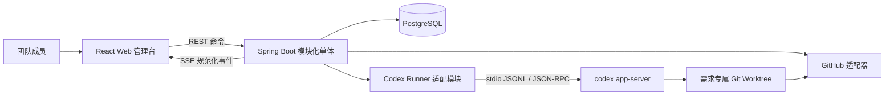
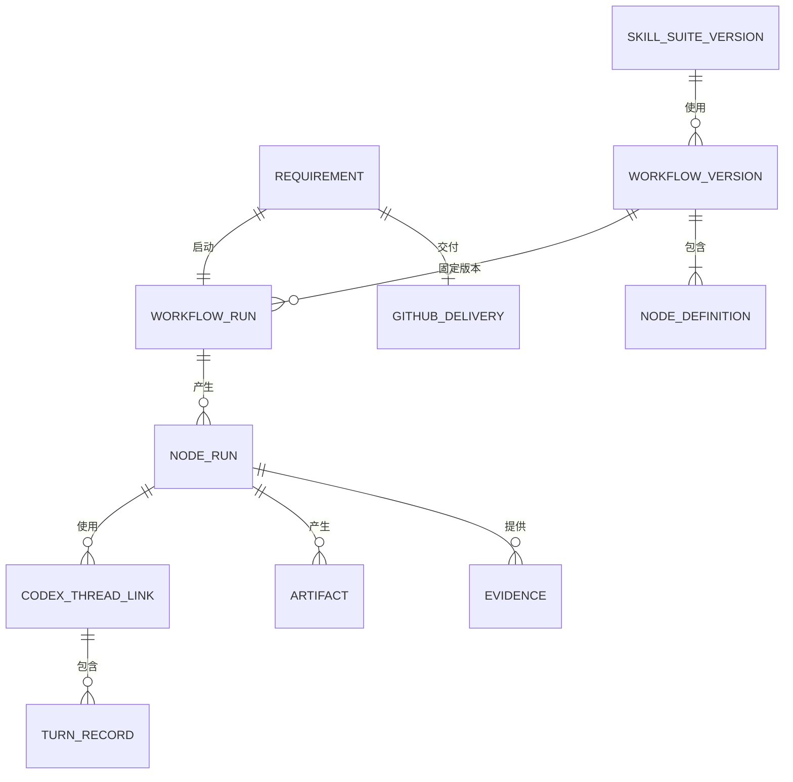

# 需求到交付流程平台设计

> 状态：已批准
> 日期：2026-08-18
> 语言约定：[CONTEXT.md](../../../CONTEXT.md)
> 研究依据：[industry-workflow-skill-nodes.md](../../research/industry-workflow-skill-nodes.md)

## 1. 产品定位

本产品是面向软件团队的“研发流程治理与证据中枢”。它通过固定的团队流程、系统指定的 Skill Suite、Codex 多轮协作和人工完成门禁，引导不熟悉团队研发方法的员工把一条需求推进到可供团队评审的 GitHub 草稿 PR。

平台负责：

- 展示并推进团队规定的需求交付流程；
- 编排人工任务、Codex Skill 节点和 GitHub 操作；
- 保存需求、SDD、计划、代码变更、测试结果和审批证据；
- 管理流程版本、Skill Suite 版本、Codex Thread 引用和业务审计；
- 在 Web 中提供 Codex 多轮对话、权限处理和运行状态展示。

平台不替代 Git、GitHub、CI/CD、Codex CLI、代码编辑器或通用项目管理系统。

## 2. 第一版成功标准

一名不了解团队研发流程的新员工，只通过 Web 页面，在不直接操作 Codex CLI 的情况下，可以按照系统引导，把一条需求从提交、澄清、SDD、开发和测试推进到 GitHub 草稿 PR，并能查看每一步的产物和记录。

第一版交付终点是成功创建 GitHub 草稿 PR。合并 PR、部署和生产发布由现有团队流程完成，不属于本版范围。

## 3. 第一版范围

### 3.1 支持

- Windows 内网单机部署；
- 四个预置角色用户登录；
- 流程模板草稿、发布和不可变版本；
- 固定顺序、人工确认和受控返工；
- 人工任务、Codex Skill、Codex Skill Chain 和 GitHub 节点；
- 每个流程版本固定一个 Skill Suite 版本；
- Codex Thread 新建、同需求内恢复和分叉；
- Codex 多轮对话、压缩、模型选择、推理强度和原生权限 Profile；
- 一条需求绑定一个现有 GitHub 主仓库；
- 一条需求拥有一个隔离 worktree 和分支；
- 推送分支、读取 GitHub Actions 状态和创建草稿 PR；
- 产物、证据、权限请求、人工确认和审计记录；
- 服务、浏览器或 Codex App Server 异常后的恢复。

### 3.2 不支持

- 用户跳过节点或申请例外；
- 并行流程节点、任意循环、动态拓扑和完整 BPMN；
- 跨需求复用 Codex Thread；
- 一个需求同时修改多个仓库；
- 用户选择或混用不同 Skill Suite；
- OpenSpec CLI、OpenSpec Schema、`/opsx:*` 命令、同步与归档协议；
- 运行实例自动追随最新流程或 Skill；
- 自助注册、用户管理和角色编辑；
- 多 Runner、多 Codex 账号和多租户隔离；
- 公网部署、高可用和不停机升级；
- 自动合并 PR、自动生产部署和生产回滚；
- 向 Web 用户提供 Codex `:danger-full-access`。

## 4. 总体架构

采用 Java 21、Spring Boot 4.1.x、Spring Modulith 2.1.x、PostgreSQL、React 19.2、TypeScript 和 React Flow 12。浏览器通过 REST 提交命令，通过 SSE 接收流程和 Codex 事件。Java 通过 stdio JSONL/JSON-RPC 管理固定版本的 `codex app-server`。



浏览器不直接连接 Codex App Server。PostgreSQL 是平台业务状态的事实源；Codex 保存完整对话状态，Git 保存代码历史，GitHub 保存远程分支、PR 和 Actions 状态。

## 5. 后端模块

第一版是一个部署单元，不拆微服务。模块之间仅通过应用服务接口或领域事件通信。

| 模块 | 职责 |
| --- | --- |
| `identity` | 四个预置用户、密码认证、会话和角色校验 |
| `requirement` | 需求信息、负责人、主仓库和整体状态 |
| `workflow-definition` | 流程模板、草稿校验、发布和不可变版本 |
| `workflow-runtime` | WorkflowRun、NodeRun、合法状态转换、排队与恢复 |
| `human-task` | 人工任务、业务确认和返工决定 |
| `skill-catalog` | Skill、SkillVersion、SkillSuiteVersion 和内容摘要 |
| `thread-runtime` | Codex Thread、Turn、Item、用户选择和外部 ID 映射 |
| `artifact` | 产物、证据、内容摘要和溯源关系 |
| `github-integration` | 仓库、worktree、分支、提交、Actions 和草稿 PR |
| `audit` | 追加式业务审计和端到端关联 ID |

`workflow-runtime` 不直接调用 Codex 或 GitHub。它在数据库事务中写入待执行外部命令，后台 Worker 再领取并执行。

## 6. 流程定义与运行

### 6.1 定义模型

```text
WorkflowTemplate
└── WorkflowVersion（发布后不可修改）
    ├── SkillSuiteVersion
    ├── Stage[]
    ├── NodeDefinition[]
    └── Transition[]

WorkflowRun
└── NodeRun[]
```

流程模板生命周期为 `DRAFT → PUBLISHED → RETIRED`：

- 草稿可编辑、预览和校验，不能启动正式需求；
- 发布版本不可修改，修改必须生成新版本；
- 停用版本不能启动新需求，但历史运行仍可读取；
- WorkflowRun 启动时固定 WorkflowVersion 和 SkillSuiteVersion；
- 新版本不改变运行中的需求。

### 6.2 节点类型

- `START`：流程入口；
- `HUMAN_TASK`：用户填写或补充信息；
- `CODEX_SKILL`：Codex 执行一个固定 Skill；
- `CODEX_SKILL_CHAIN`：按固定顺序执行同一套件内的多个 Skill；
- `HUMAN_CONFIRM`：人工确认产物满足完成门禁；
- `GITHUB_TASK`：执行受控 Git/GitHub 操作；
- `END`：流程完成。

### 6.3 默认流程


员工页面将上述节点分为六个可理解的阶段：需求、分析、SDD、开发、评审、交付。

### 6.4 推进规则

- 用户只能操作当前已激活节点；
- 所有规定节点都必须完成，不提供跳过或例外；
- 节点只有在必需产物和完成门禁满足后才能提交；
- AI 执行失败停留在当前节点；
- 用户可继续当前 Thread、重试失败 Turn 或选择当前需求内的兼容 Thread；
- 人工不通过时只返回流程定义明确规定的返工入口；
- 主流程不允许任意循环；返工边是受控且可审计的唯一回边；
- AI 不能批准自己的产物，也不能自行推进业务节点。

## 7. Skill Suite

### 7.1 兼容格式

Skill 保持兼容 Agent Skills，以 `SKILL.md` 为入口，可包含引用、模板、脚本和资源。平台在套件外层增加治理清单。

```text
superpowers/
├── suite.yaml
├── skills/
│   ├── brainstorming/
│   │   ├── SKILL.md
│   │   └── references/
│   ├── writing-plans/
│   │   └── SKILL.md
│   └── test-driven-development/
│       ├── SKILL.md
│       └── scripts/
└── assets/
```

`suite.yaml` 记录套件 ID、版本、内容摘要、Skill 入口、允许的内部调用关系、所需 Codex 能力、维护者和发布状态。

### 7.2 运行约束

- 流程管理员在 WorkflowVersion 中固定 SkillSuiteVersion；
- 普通用户不选择 Skill Suite 或 Skill；
- 节点固定主 Skill 或 Skill Chain；
- Runner 只向 Thread 暴露该流程固定的 Skill Suite；
- 启动 Turn 时显式传入主 Skill，避免依赖模型猜测；
- Skill 可按其说明调用同套件中的其他 Skill；
- 平台不解析或改写 `SKILL.md` 的内部方法；
- 每次运行记录套件版本、Skill 路径和内容摘要；
- 第一版只借鉴 OpenSpec 的工件依赖与归档思想，不集成 OpenSpec CLI、Schema 或 `/opsx:*` 命令；
- 后续若确有需要，OpenSpec 只能通过独立工件协议适配器接入，不能作为第二套 Skill 混入，也不能成为流程状态的第二事实源。

### 7.3 Skill Chain

- 每个 Skill 使用独立 Turn；
- 默认在同一个 Thread 中按顺序执行；
- 前一步成功后才能启动下一步；
- 失败时停在失败的 Skill；
- 用户可以继续对话，再重试失败 Skill；
- Codex 内部触发的辅助 Skill 只记录，不转换成新的流程节点。

## 8. Codex 集成

### 8.1 协议与版本

- 使用安装在 Windows 主机上的 Codex CLI；
- 主要协议是 `codex app-server` 的默认 stdio JSONL/JSON-RPC；
- 固定 Codex CLI 版本，不随系统更新自动升级；
- 由同一 Codex 二进制生成匹配的协议 Schema；
- 升级前运行握手、Thread 恢复、Skill 注入、权限请求、压缩和终态契约测试；
- 不依赖实验性 WebSocket listener；
- `codex exec` 仅作为诊断或降级工具，不是主运行协议。

### 8.2 平台对象映射

| 平台对象 | Codex 对象 |
| --- | --- |
| 一段持续 AI 协作 | Thread |
| 用户输入或一次 Skill 调用 | Turn |
| 消息、命令、文件修改或工具调用 | Item |
| 手动压缩 | `thread/compact/start` |
| 继续对话 | `thread/resume` |
| 分叉方案 | `thread/fork` |

一个 AI 节点默认创建独立 Thread。用户可以在启动或继续节点时选择：

- 创建新 Thread；
- 恢复当前需求中的兼容 Thread；
- 从当前需求中的兼容 Thread 分叉。

跨需求复用被禁止。候选 Thread 必须属于当前需求，并与仓库、worktree 和权限环境兼容。

### 8.3 Codex 配置

- 模型、推理强度和权限 Profile 从 App Server 动态读取；
- Java 和前端不写死模型列表；
- 新 Thread 允许用户选择配置；
-恢复 Thread 默认沿用原配置，显式切换需展示提示并写入审计；
- 第一版允许 `:read-only`、`:workspace` 和符合主机策略的自定义 Profile；
- 第一版不展示 `:danger-full-access`；
- 权限规则由 Codex 原生系统执行，平台不复制一套沙箱实现。

### 8.4 多轮与完成语义

- Web 用户可向当前 Thread 继续发送消息；
- Java 转发 App Server 流式事件，并规范化为平台事件；
- 用户可触发 Thread 压缩；
- Codex 返回“完成”只表示本轮结束；
- 用户确认且完成门禁通过后，NodeRun 才可成功；
- Codex 权限批准与业务完成确认是两个独立概念。

## 9. 身份与角色

第一版使用 Spring Security 本地账号密码认证，预置且仅支持以下四个用户：

| 用户名 | 角色 | 权限重点 |
| --- | --- | --- |
| `platform-admin` | 平台管理员 | 系统设置、Runner 和连接状态 |
| `workflow-admin` | 流程管理员 | 流程与 Skill Suite 草稿、校验和发布 |
| `member` | 参与者 | 提交需求、处理人工任务、使用 Codex 节点 |
| `approver` | 审批者 | 评审需求、SDD 和交付产物 |

约束：

- 密码使用 BCrypt 摘要；
- 初始密码由环境配置注入，不写入源码；
- 登录状态使用安全 Cookie Session；
- 不提供注册、用户新增、禁用、删除、改角色或密码找回；
- 四个用户共用运行主机的 Codex CLI 账号；
- 平台记录实际操作的平台用户，但 Codex 模型额度和账单归属于共享 Codex 账号。

## 10. 员工页面

### 10.1 导航

```text
我的工作台
├── 我的待办
├── 我发起的需求
└── 最近运行的 Codex Thread

需求详情
├── 概览与负责人
├── 流程时间线
├── 当前节点工作台
├── 产物与证据
└── 审计记录
```

员工端不展示流程画布、Skill 配置和低层协议状态。

### 10.2 当前节点工作台

采用已确认的“A：引导式三栏工作台”：

- 左栏：完整流程、当前阶段和整体进度；
- 中栏：当前步骤说明、Codex 对话和实时运行状态；
- 右栏：完成条件、产物、证据、权限请求和提交按钮。

界面吸收“新员工清单向导”的文案原则，始终回答：现在做什么、为什么做、Codex 正在做什么、还缺什么、下一步是什么。

一次性设计原型位于 `prototypes/flowpilot-ui/`，明确不得直接作为生产代码使用。

## 11. 管理员页面

```text
流程管理
├── 流程模板
├── 草稿编辑
├── 发布新版本
└── 历史版本

Skill 管理
├── Skill Suite
├── Skill 文件与详情
├── 版本校验
└── 发布或停用

系统管理
├── Codex Runner 状态
├── GitHub 连接状态
└── 系统审计
```

第一版没有用户管理页面。

## 12. 领域对象与状态



WorkflowRun 状态：

```text
ACTIVE → COMPLETED
       → CANCELED
```

NodeRun 状态：

```text
PENDING → READY → RUNNING
                    ├→ WAITING_USER
                    ├→ WAITING_CODEX_PERMISSION
                    ├→ SUCCEEDED
                    └→ FAILED
```

状态只能由 `workflow-runtime` 的集中转换服务修改。Controller、Webhook、SSE 和外部适配器不能直接更新当前状态。

## 13. 产物、证据与审批

Artifact 是版本化工作成果，包括需求分析、SDD、计划、代码变更和测试报告。Evidence 是用于证明完成门禁的事实或引用，包括人工确认、测试结果、提交 SHA、GitHub 检查和 PR 信息。

规则：

- 每个 Artifact 记录来源 NodeRun、版本、摘要、类型和存储引用；
- 审批绑定具体 Artifact 版本或内容摘要；
- 被审批产物变化后，旧审批失效；
- 完整大文件保存在 Git 或专用文件目录，数据库保存元数据和引用；
- Codex 增量文本用于实时展示，长期保存最终消息、关键工具调用、产物、证据和审计引用；
- 权限请求绑定 `workflowRunId/nodeRunId/threadId/turnId/itemId`；
- Codex 权限请求的批准不满足业务完成门禁。

## 14. Git 与 GitHub

- 流程启动时绑定一个现有 GitHub 主仓库；
- 为需求创建专属 worktree 和隔离分支；
- Codex 只能修改该 worktree；
- Git 操作通过标准 Git CLI；
- GitHub 适配器第一版复用主机上的 GitHub CLI 登录；
- 平台可推送隔离分支、读取 Actions 检查并创建草稿 PR；
- 平台不自动合并 PR；
- Draft PR 创建成功并保存编号、URL、head/base 和 head SHA 后，WorkflowRun 完成；
- 所有 GitHub 外部命令具有幂等键并保存外部对象 ID；
- GitHub Webhook 按 delivery ID 去重，并通过定期对账修复漏投或响应丢失。

## 15. 浏览器通信

- 所有状态改变使用 REST `POST`；
- 命令携带幂等键和期望业务版本；
- AI 增量输出、节点进度、权限请求、Artifact 更新和终态使用 SSE；
- SSE 事件拥有单调递增 ID；
- 浏览器通过 `Last-Event-ID` 恢复缺失事件；
- 前端按事件 ID 去重；
- SSE 断开不取消后台任务；
- 第一版不使用 WebSocket，因为客户端到服务端的输入是低频命令。

## 16. 并发与排队

- 一个受监督的 Codex App Server 子进程管理多个 Thread；
- 同时最多运行两个 Codex Turn；
- 其他 Turn 按创建时间进入数据库队列；
- 并发上限是启动配置，默认值为 2；
- 同一需求同一时刻最多有一个修改代码的活跃 Turn；
- 代码评审 Thread 必须在开发 Turn 稳定结束后启动，避免同时修改 worktree。

## 17. 可靠性与恢复

### 17.1 事务与外部副作用

- 状态转换、审计事件和待执行外部命令在同一数据库事务中提交；
- 外部命令由后台 Worker 领取；
- 每个命令拥有唯一 operation key、租约、尝试次数和下次执行时间；
- Worker 崩溃后，租约到期的任务可重新领取；
- 外部调用必须幂等，或通过已保存的外部对象 ID 去重。

### 17.2 恢复场景

- Java 服务重启：从数据库恢复未完成 NodeRun 和待执行命令；
- Codex App Server 退出：重新启动进程，并通过保存的 Thread ID 恢复；
- 浏览器刷新或 SSE 断线：后台继续，前端从最后事件 ID 补齐；
- GitHub 已成功但响应丢失：通过仓库、分支、head SHA 和 PR 查询对账；
- 重复 Webhook：通过 delivery ID 唯一约束忽略；
- 重复节点完成命令：通过幂等键和期望状态版本只推进一次；
- Skill 内容漂移：启动 Turn 前校验固定路径和摘要，不一致则拒绝执行；
- 工作区保留至需求完成或取消，之后由受控清理任务处理。

## 18. 部署与安全

第一版运行在一台受控 Windows 内网主机：

```text
Windows 服务主机
├── Spring Boot JAR（包含 React 静态资源）
├── PostgreSQL
├── 固定版本 codex app-server
├── Git 与 GitHub CLI
└── 需求隔离工作区根目录
```

安全边界：

- 服务只监听本机或明确配置的受控内网地址；
- Codex 凭据由 Codex CLI 自己保存，Java 不读取或复制；
- GitHub 凭据由 GitHub CLI 保存；
- 数据库只保存连接状态和外部引用；
- 日志不写密码、令牌、完整环境变量或敏感 Prompt；
- worktree 根目录必须是显式绝对路径；
- 删除 worktree 前验证目标仍位于专用根目录；
- 共享 Codex 账号的额度耗尽会影响所有平台用户，页面展示 Codex 返回的真实状态。

## 19. 测试与验收

### 19.1 后端

- 状态机合法推进、禁止跳过、失败重试和返工测试；
- 流程发布不可变与运行实例版本固定测试；
- Skill Suite 摘要和跨套件调用拒绝测试；
- 四个预置角色的权限测试；
- Spring Modulith 模块边界测试；
- PostgreSQL 事务、幂等键、任务租约和重启恢复集成测试。

### 19.2 Codex

- 默认使用假的 App Server 进程模拟 Thread、Turn、Item、权限请求、压缩和故障；
- 使用固定版本真实 Codex CLI 执行少量契约测试；
- 契约测试覆盖握手、Thread 恢复、Skill 注入、模型/权限枚举和终态事件。

### 19.3 GitHub

- 默认使用模拟 GitHub API/CLI；
- 使用专门测试仓库执行分支推送和 Draft PR 冒烟测试；
- 验证重复请求、Webhook 去重和外部成功但响应丢失后的对账。

### 19.4 前端与端到端

- React Testing Library 验证步骤引导、角色可见性和按钮状态；
- 测试 SSE 重连、重复事件和乱序事件；
- Playwright 覆盖完整员工链路；
- 以方案 A 的关键布局作为视觉回归基线。

必须验证以下故障场景：

1. Codex 执行中 Java 服务重启；
2. App Server 异常退出后恢复 Thread；
3. 浏览器刷新或 SSE 断线；
4. 同一完成命令重复提交；
5. GitHub 已创建 PR，但平台未收到成功响应；
6. AI 声称完成，但必需证据缺失；
7. 用户尝试跳过当前节点；
8. 两个用户同时操作同一节点。

第一版验收要求是：自动测试通过，并在一个真实测试仓库中用 `member` 和 `approver` 账号完整走通默认流程，最终创建 GitHub 草稿 PR。

## 20. 后续升级触发条件

第一版不提前引入通用流程引擎。当出现以下已验证需求时，优先评估把 `workflow-runtime` 替换为嵌入式 Flowable 8：

- 管理员经常需要并行、包容网关、边界计时器或事件子流程；
- 运行中流程实例迁移成为常态；
- 人工任务需要复杂候选组、代理、升级和批量迁移；
- 大量开发时间持续消耗在通用流程语义，而非 Skill、产物和交付治理。

只有在系统拆成多个独立 Worker、需要跨服务可靠执行和水平扩展后，才重新评估 Temporal 或 Camunda 8。
